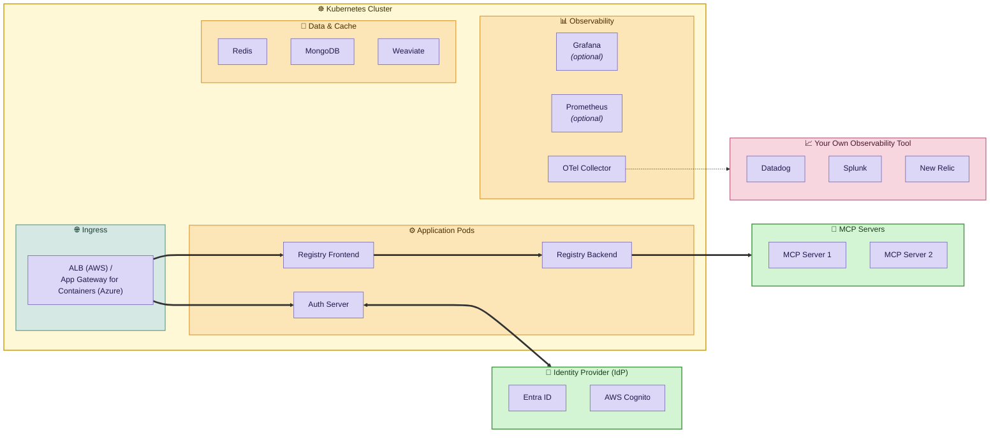

# Jarvis Registry Deployment Guide — Production (Component Reference)

> This guide is cloud-platform-agnostic. It describes **what components are needed and why** for deploying Jarvis Registry to an existing Kubernetes cluster on AWS (EKS) or Azure (AKS). Sections that differ between platforms are clearly marked.

---

## Prerequisites

Before starting this guide, the following must already be in place:

- ✅ A **working Kubernetes cluster** with a dedicated application node pool available
- ✅ `kubectl` configured and connected to the cluster
- ✅ **OIDC / Workload Identity** enabled on the cluster (required for pod-level cloud identity)
- ✅ An **Identity Provider (IdP)** configured — Microsoft Entra ID (Azure AD) is the default supported provider

> **AWS (EKS):** Admin access to the client's AWS account. The cluster's OIDC provider must be enabled.

> **Azure (AKS):** Admin access to the client's Azure subscription and an existing Resource Group. Both OIDC Issuer and Workload Identity must be enabled on the cluster. The cluster must have a **System node pool** (for Kubernetes system components) and a **User node pool** (for application workloads).

> 📌 **SSL/TLS Reminder:** A valid TLS certificate for the client domain must be in place before the Helm release is finalized. On **AWS**, provision this via AWS Certificate Manager (ACM) and note the certificate ARN. On **Azure**, cert-manager (installed in Phase 1) handles certificate issuance automatically.

---

## Overview — Deployment Phases

| # | Phase | Description |
|---|---|---|
| 1 | Cluster Drivers & Add-ons | Load balancing, storage, and secrets sync |
| 2 | Identity & Permissions | Fine-grained pod-level cloud access |
| 3 | Application Cloud Resources | Secrets store and file storage |
| 4 | Application Secrets | All runtime environment variables |
| 5 | Registry Helm Chart Deployment | Registry workloads on Kubernetes |
| 6 | DNS Finalization | Domain wiring and certificate validation |

---

## Phase 1 — Cluster Drivers & Add-ons

The following drivers must be installed into the existing cluster to enable load balancing, storage, and secrets management for the Registry.

### Shared (Both Platforms)

| Driver / Add-on | Delivery | Purpose |
|---|---|---|
| **External Secrets Operator** | Helm Release | Watches `ExternalSecret` resources and syncs secrets from the cloud secrets store into Kubernetes `Secret` objects. Requires cloud identity. |
| **MongoDB Community Operator** | Helm Release | Enables declarative MongoDB cluster management inside Kubernetes. Must be installed before the Jarvis-registry Helm release. |

### AWS (EKS)

| Driver / Add-on | Delivery | Purpose |
|---|---|---|
| **AWS Load Balancer Controller** | Helm Release | Provisions and manages AWS ALBs from Kubernetes Ingress resources. Requires IRSA. |
| **AWS EBS CSI Driver** | EKS Managed Add-on | Enables dynamic EBS-backed Persistent Volume provisioning. Required for MongoDB and Weaviate. Requires IRSA. |
| **Amazon CloudWatch Observability** | EKS Managed Add-on *(optional)* | Forwards container logs and metrics to CloudWatch. Requires IRSA. |

> ⚠️ The EBS CSI Driver and CloudWatch add-ons must have their IRSA role configured **before** the add-on is activated. Verify IRSA is attached in the EKS Console → Add-ons tab.

### Azure (AKS)

| Driver / Add-on | Delivery | Purpose |
|---|---|---|
| **Azure ALB Controller** | Helm Release | Manages Azure Application Gateway for Containers from Kubernetes Ingress resources. Requires a Managed Identity with Workload Identity federation. |
| **cert-manager** | Helm Release | Automates TLS certificate issuance and renewal for the Registry Ingress domain. |

> ⚠️ Note: AKS has Azure Disk CSI built in — no separate storage driver installation is needed.

> ⚠️ The ALB Controller and External Secrets Operator each require their Federated Identity Credentials to be configured before their Helm releases are installed (see Phase 2).

---

## Phase 2 — Identity & Permissions

Pod-level cloud access is granted through each platform's workload identity mechanism. No static credentials or secrets are mounted into pods.

### AWS (EKS) — IRSA (IAM Roles for Service Accounts)

IAM roles are assumed by Kubernetes service accounts via OIDC federation with the EKS cluster.

| Role | Permissions | Used By |
|---|---|---|
| **Registry Role** | S3 list (all buckets), Secrets Manager read on registry secret, Bedrock full | Registry backend pod |
| **External Secrets Role** | `secretsmanager:GetSecretValue`, `secretsmanager:DescribeSecret` — scoped to the registry secret ARN | External Secrets Operator |
| **ALB Controller Role** | EC2, ELBv2, IAM — scoped to ALB management | AWS Load Balancer Controller |
| **EBS CSI Driver Role** | EC2 EBS volume create / attach / delete / describe | EBS CSI Driver add-on |
| **CloudWatch Agent Role** | CloudWatch Logs write, `PutMetricData` | CloudWatch Observability add-on *(if enabled)* |
| **AgentCore Federation Role** | `bedrock-agentcore:ListAgentRuntimes`, `GetAgentRuntime`, `InvokeAgentRuntime` — assumed by the Registry role | AgentCore integration *(if enabled)* |

### Azure (AKS) — Workload Identity (User-Assigned Managed Identities + Federated Identity Credentials)

Kubernetes service accounts are federated to Azure Managed Identities through the AKS OIDC issuer.

**Managed Identities and their Azure RBAC roles:**

| Identity | Azure Role | Scope | Used By |
|---|---|---|---|
| **ALB Controller MI** | Network Contributor | Resource Group + AKS node resource group (`MC_*`) | Azure ALB Controller |
| **ALB Controller MI** | AppGw for Containers Configuration Manager | AKS node resource group (`MC_*`) | Azure ALB Controller |
| **External Secrets MI** | Key Vault Secrets User | Key Vault | External Secrets Operator (operator + SecretStore) |
| **Registry MI** | Key Vault Secrets User | Key Vault | Registry backend pod |

**Federated Identity Credentials** (binds each MI to a specific Kubernetes service account via the AKS OIDC issuer):

| Federated Credential | Managed Identity | Kubernetes Service Account |
|---|---|---|
| ALB Controller FIC | ALB Controller MI | `azure-alb-system` namespace → `alb-controller-sa` |
| ESO Operator FIC | External Secrets MI | `external-secrets` namespace → `external-secrets` |
| ESO SecretStore FIC | External Secrets MI | `jarvis` namespace → `external-secrets-service-account` |
| Registry FIC | Registry MI | `jarvis` namespace → `registry-service-account` |

---

## Phase 3 — Application Cloud Resources

### AWS (EKS)

| Resource | Purpose |
|---|---|
| **Secrets Manager — Registry Secret** | All Registry application environment variables stored as a single JSON blob. Synced into the cluster by External Secrets Operator. |

### Azure (AKS)

| Resource | Purpose |
|---|---|
| **Azure Key Vault** | Stores all Registry application secrets as individual Key Vault Secrets. Accessed by pods via External Secrets Operator using Workload Identity. RBAC-based authorization enabled. Soft-delete enabled (7-day retention). |

---

## Phase 4 — Application Secrets

All secrets must be populated **before** deploying the Helm chart.

> **AWS (EKS):** Secrets are stored as a **single JSON blob** in AWS Secrets Manager.

> **Azure (AKS):** Secrets are stored as **individual secrets** in Azure Key Vault. Placeholder values are created automatically and must be updated with real values before deployment.

| Category | Keys | Notes |
|---|---|---|
| **Crypto / Auth Tokens** | `SECRET_KEY`, `CREDS_KEY`, `JWT_PRIVATE_KEY`, `JWT_PUBLIC_KEY` | Generate using the Registry's built-in Generate Secrets page |
| **Identity Provider (Entra ID)** | `AUTH_PROVIDER`, `ENTRA_TENANT_ID`, `ENTRA_CLIENT_ID`, `ENTRA_CLIENT_SECRET` | Obtained from Azure Portal → App Registrations. `ENTRA_CLIENT_SECRET` must be the **secret value**, not the secret ID. |
| **Domain Config** | `DOMAIN_CLIENT`, `DOMAIN_SERVER` | Use the client's Registry domain |
| **AgentCore / AI Foundry** *(optional)* | Foundry endpoint, project endpoint, model deployment names | Required if Azure AI Foundry or AgentCore is used as the LLM/agent backend |

---

## Phase 5 — Registry Helm Chart Deployment

The Registry is deployed as a **single Helm release** into the `jarvis` namespace with the release name `jarvis-registry`. Thw helm chart is still under development.

### 5.1 Application Pods

These pods are the same on both platforms:

| Component | Role | Node Affinity |
|---|---|---|
| **Registry Backend** | Core backend — MCP server registry, A2A agent registry, tool discovery | User / On-Demand |
| **Registry Frontend** | Web UI — browse and manage MCP servers and agents | User / On-Demand |
| **Auth Server** | OAuth2/OIDC authentication proxy — handles Entra ID login flow (port 8888) | User / On-Demand |
| **MongoDB** | Primary database — stores registry entries, users, and RBAC configuration | User / On-Demand |
| **Weaviate** | Vector database — semantic search over registered tools and agents | User / On-Demand |
| **Redis** | Session cache and task queue broker | Any |
| **Prometheus** | Metrics collection from all Registry services | Any |
| **Grafana** | Metrics dashboard for observability | Any |
| **OpenTelemetry Collector** | Collects and forwards traces, metrics, and logs from all services | Any |

### 5.2 Kubernetes Resources Created by the Helm Chart

**Shared (Both Platforms):**

| Resource | Purpose |
|---|---|
| **SecretStore** | Configures External Secrets Operator to connect to the platform secrets store (Secrets Manager or Key Vault) |
| **ExternalSecret** | Pulls secrets from the cloud store and injects them as a Kubernetes `Secret` in the `jarvis` namespace |
| **Service Account — Registry** | Annotated with the platform identity reference (IRSA role ARN or Workload Identity client ID + tenant ID) |
| **Service Account — ESO SecretStore** | Annotated with the External Secrets platform identity reference |
| **Ingress** | Routes traffic to the Registry Frontend with TLS |

**AWS (EKS) only:**

| Resource | Purpose |
|---|---|
| **StorageClass (EBS)** | gp3 encrypted EBS-backed storage class used as Persistent Volumes by MongoDB and Weaviate |
| **ALB Ingress** | Internet-facing ALB. SSL terminates at the ALB using the ACM certificate ARN. Public subnet IDs must be specified in annotations. |

**Azure (AKS) only:**

| Resource | Purpose |
|---|---|
| **ALB Ingress (Application Gateway for Containers)** | TLS termination handled by cert-manager. Public subnet ID specified for ALB placement. |

### 5.3 Key Helm Values to Configure Per Client

**Shared:**
- Image tags for Registry backend and frontend
- Client domain name (for Ingress host rules)
- Public subnet ID (for load balancer placement)
- Helm chart version

**AWS (EKS) specific:**
- AWS Secrets Manager secret name (remote reference for ExternalSecret)
- ACM certificate ARN (for ALB HTTPS listener)
- AWS region (for SecretStore provider config)
- Node selectors for stateful workloads (`eks.amazonaws.com/capacityType: ON_DEMAND`)
- IRSA role ARNs for Registry and External Secrets service accounts

**Azure (AKS) specific:**
- Azure Key Vault URI (for SecretStore provider config)
- Registry Managed Identity client ID and tenant ID
- External Secrets Managed Identity client ID and tenant ID
- ACR login server (for OCI Helm chart pull)
- AI Foundry endpoint and model config *(if applicable)*

---

## Phase 6 — DNS Finalization

### AWS (EKS)

After the Helm chart is deployed, the **ALB DNS name** is available in the AWS EC2 Console → Load Balancers.

1. Provide the client with the **ALB DNS name**
2. Client creates a **CNAME record** pointing their domain → ALB DNS name
3. Confirm the ACM certificate is in **Issued** status
4. Verify HTTPS resolves correctly on the client's domain

### Azure (AKS)

After the Helm chart is deployed, the **Application Gateway for Containers** frontend hostname or IP is available in the Azure Portal.

1. Provide the client with the **Application Gateway frontend hostname or IP**
2. Client creates a **CNAME** (or A record) pointing their domain → the Application Gateway address
3. Confirm **cert-manager** has successfully issued the TLS certificate (check `Certificate` resource status in the `jarvis` namespace)
4. Verify HTTPS resolves correctly on the client's domain

---

## Post-Deployment Checklist

- [ ] All pods in the `jarvis` namespace are in **Running** state
- [ ] Load balancer / Application Gateway is active and the domain resolves correctly
- [ ] HTTPS is accessible on the client domain with a valid TLS certificate
- [ ] Client can log in via Entra ID (or configured IdP) successfully
- [ ] MCP servers and agents are visible and discoverable in the Registry UI