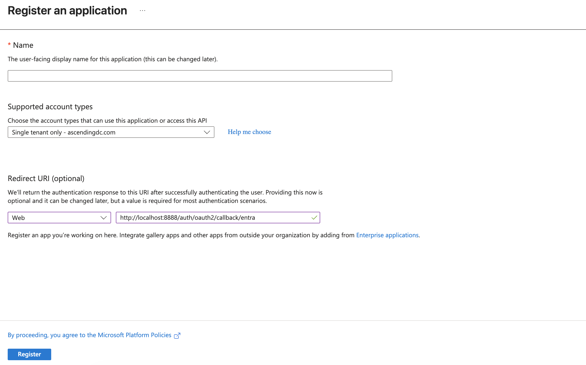
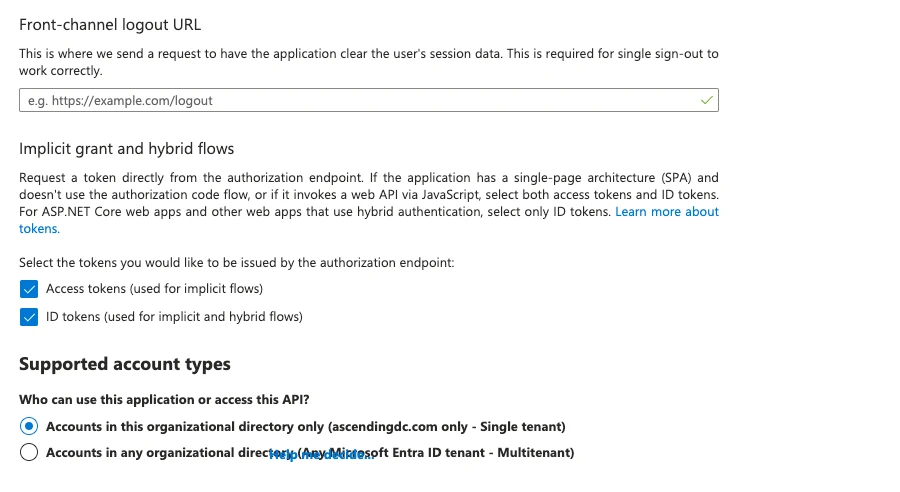

# Microsoft Entra ID (Azure AD) Setup Guide

This guide provides step-by-step instructions for setting up Microsoft Entra ID (formerly Azure AD) as an authentication provider in Jarvis Registry.

## Prerequisites

- An Azure subscription with Entra ID (Azure AD) tenant
- Access to the Azure Portal with administrative privileges
- Jarvis Registry deployed and accessible

## Step 1: Create App Registration in Azure Portal

1. **Navigate to Azure Portal**
   - Go to [Azure Portal](https://portal.azure.com)
   - In the search box, type “Azure Entra” and click on it.
   - On the left menu, click on App registrations and then on New registration.

2. **Create New Registration**
   - Click **New registration**
   - **Name**: `Jarvis Registry` (or your preferred name)
   - **Supported account types**:
     - For single tenant: *Accounts in this organizational directory only*
   - **Redirect URI**:
     - Type: **Web**
     - URI: `https://your-registry-domain/auth/oauth2/callback/entra`
     - Replace `your-registry-domain` with your actual registry URL, use `http://localhost:8888/auth/oauth2/callback/entra` for local deployment
  
   

3. **Register the Application**
   - Click **Register**
   - Note down the **Application (client) ID** and **Directory (tenant) ID**

## Step 2: Configure Authentication

1. **Configure Platform Settings**
   - In your app registration, go to **Authentication**
   - Under **Platform configurations**, ensure your redirect URI is listed
   - **Implicit grant**: Enable **ID tokens** and **Access tokens**



## Step 3: Create Client Secret

1. **Generate New Secret**
   - In your app registration, go to **Certificates & secrets**
   - Click **New client secret**
   - **Description**: `Jarvis Registry Secret`
   - **Expires**: Choose appropriate expiration (recommended: 12-24 months)
   - Click **Add**

2. **Copy the Secret Value**
   - **Important**: Copy the secret value immediately - it won't be shown again
   - Store this securely

## Step 4: Environment Configuration

Add the following environment variables to your Jarvis Registry deployment:

### Required Variables

```bash
# Microsoft Entra ID Configuration
ENTRA_CLIENT_ID=your-application-client-id
ENTRA_CLIENT_SECRET=your-client-secret-value
ENTRA_TENANT_ID=your-tenant-id-or-common
```

### Optional Configuration Variables

```bash
# Token Configuration
# Determines which token to use for extracting user information
# - 'id': Extract user info from ID token (default, recommended)
# - 'access': Extract user info from access token
# If token extraction fails, the system will automatically fallback to Graph API
ENTRA_TOKEN_KIND=id

ENTRA_GRAPH_URL=https://graph.microsoft.com

# Custom Claim Mappings (defaults are shown)
ENTRA_USERNAME_CLAIM=preferred_username
ENTRA_GROUPS_CLAIM=groups
ENTRA_EMAIL_CLAIM=upn
ENTRA_NAME_CLAIM=name
```

### Token Kind Configuration


The `ENTRA_TOKEN_KIND` variable determines how user information is extracted:

**Screenshot:**


- **`id` (default, recommended)**: Extracts user info from ID token
  - Fast: Local JWT decoding, no network calls
  - Standard: OpenID Connect standard approach
  - Contains standard user claims: username, email, name, groups

- **`access`**: Extracts user info from access token
  - Used when ID token is not available
  - May not contain all user claims

- **Automatic fallback**: If token extraction fails, the system automatically falls back to Microsoft Graph API

**Example Configuration:**
```bash
# Use ID token for user info (recommended - fast, standard OIDC)
ENTRA_TOKEN_KIND=id

# Use access token for user info (alternative)
ENTRA_TOKEN_KIND=access
```

## Step 5: Test the Setup

1. **Restart Services**
   - Restart the authentication server and registry services

2. **Test Authentication Flow**
   - Navigate to your registry login page
   - Select "Microsoft Entra ID" as the authentication method
   - Complete the Microsoft login process
   - Verify successful authentication and user information retrieval

## Step 6: Optional Configurations

### Group Membership Access

To retrieve user group memberships from Azure AD, ensure the following permissions are granted:

1. **In Azure Portal** → Your app registration → **API permissions**
2. Add **Microsoft Graph** → **Delegated permissions**:
   - `Group.Read.All` - Read all groups
   - Or `Directory.Read.All` - Read directory data (includes groups)
3. Click **Grant admin consent** (requires admin privileges)

**Note**: Without these permissions, the `groups` field in user info will be empty, but authentication will still work.

### Custom Scopes
Modify the `scopes` configuration in `oauth2_providers.yml` to include additional Microsoft Graph permissions as needed.

## Troubleshooting

### Common Issues

1. **Invalid Redirect URI**
   - Ensure the redirect URI in Azure matches exactly with your registry callback URL
   - Check for trailing slashes and protocol (http vs https)

2. **Insufficient Permissions**
   - Verify all required API permissions are granted with admin consent
   - Check that the user has appropriate permissions in Entra ID

3. **Token Validation Failures**
   - Verify client ID, tenant ID, and client secret are correct
   - Check token audience and issuer configuration

4. **Sovereign Cloud Issues**
   - For Azure Government or China clouds, set the appropriate `ENTRA_GRAPH_URL`
   - Ensure app registration is in the correct cloud environment
   - Verify OAuth endpoints match your cloud environment

5. **Token Kind Configuration**
   - If using `ENTRA_TOKEN_KIND=id` but ID token is not available, system will fallback to access token
   - If using `ENTRA_TOKEN_KIND=access`, ensure access token contains user claims
   - Check logs to see which token extraction method was used

### Logs and Debugging

Enable debug logging to troubleshoot authentication issues:

```bash
# Set log level to DEBUG in your environment
AUTH_LOG_LEVEL=DEBUG
```

Check authentication server logs for detailed error messages and token validation information.

## Security Considerations

- **Client Secrets**: Rotate client secrets regularly and store them securely
- **Token Validation**: The implementation validates token signatures, expiration, and audience
- **JWKS Caching**: JWKS are cached for 1 hour to reduce API calls while maintaining security
