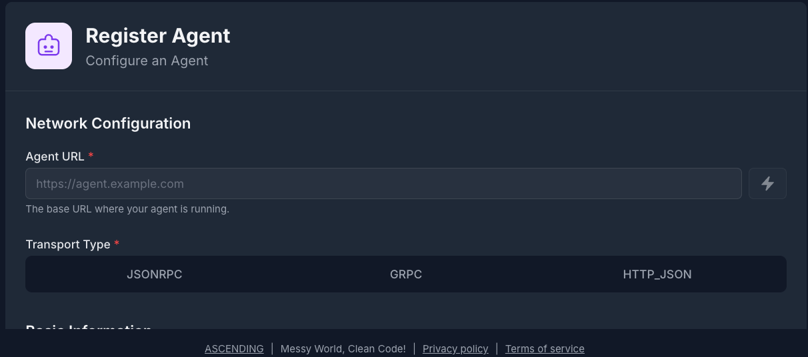
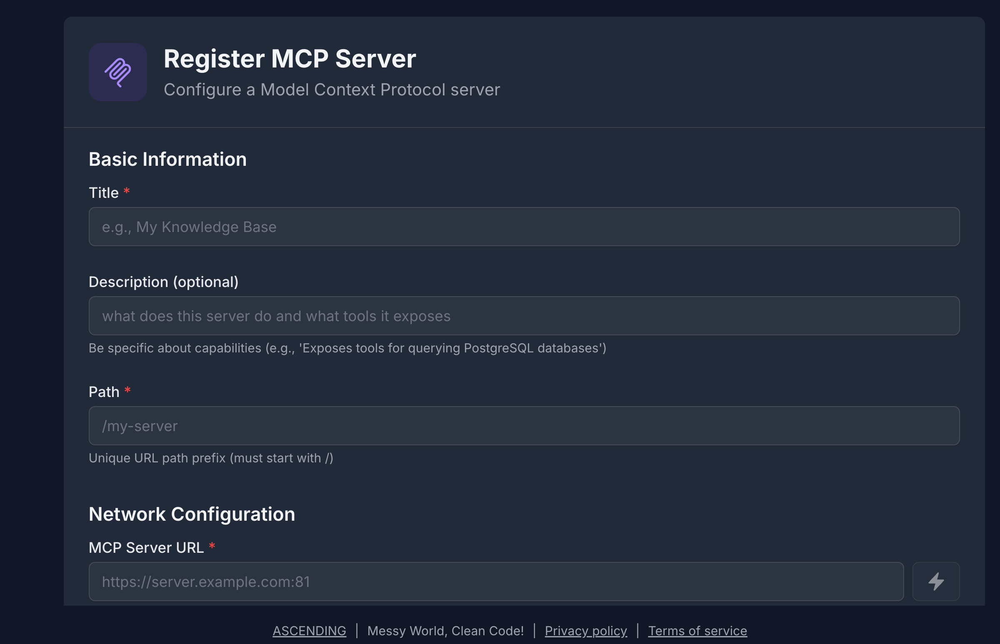
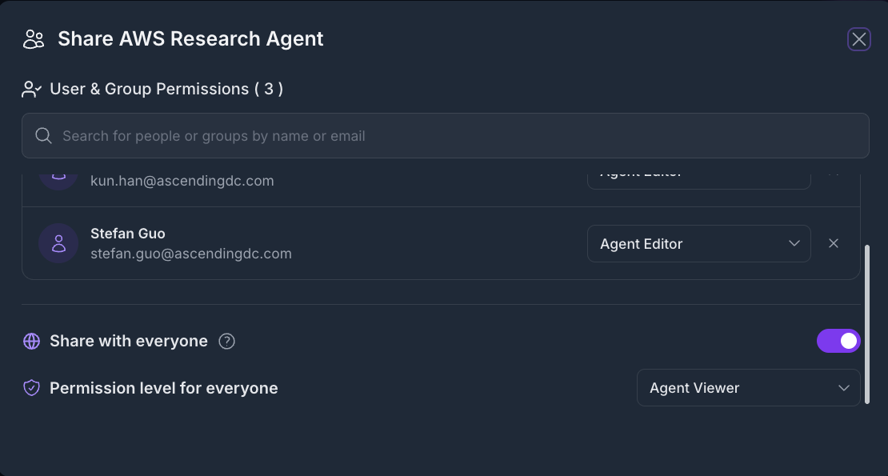
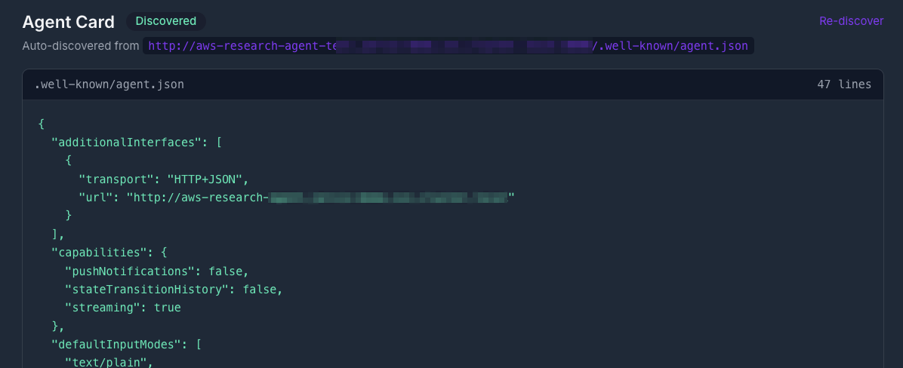

# A2A Agent Registry

The A2A Agent Registry is the central catalog for [autonomous agents](https://exploreagentic.ai/agentic-ai/) exposed through Jarvis Registry. It lets platform teams register agents, organize them by skills and capabilities, control who can access them, and expose them through the same secure gateway used for MCP servers.

---

## What is an A2A Agent?

An A2A agent is an autonomous service that exposes its capabilities through an agent card and a runtime endpoint. Unlike a single MCP tool, an A2A agent typically represents a higher-level worker such as code review, testing, data analysis or documentation generation. For a deeper look at how agentic AI systems are architected in enterprise settings, see [Agentic AI on Explore Agentic](https://exploreagentic.ai/agentic-ai/) and the [Jarvis AI Agents](https://ascendingdc.com/jarvis-ai/agent-flow/) product page.

Common examples include:

- **Code agents** — code review, test generation, bug triage
- **Data agents** — analytics, reporting, summarization
- **Security agents** — vulnerability review, policy validation

Once registered, these agents become discoverable and governable in one place. How clients discover and invoke them through the gateway is covered in [Registry Endpoint](registry-endpoint.md).

---

## Registering an A2A Agent

The registration form captures the metadata the registry needs to catalog and route to an agent:

- **Name & Description** — clear identity and business purpose
- **Agent Path / URL** — where the agent is reachable
- **Transport Type** — how the registry communicates with the agent runtime
- **Skills & Tags** — what the agent can do and how users can discover it
- **Well-Known Sync** — whether agent metadata should be refreshed automatically

---

## The Agent Catalog

After registration, agents appear in the registry catalog alongside their current status, skills, tags, and access controls.

A typical catalog view helps teams:

- **Search by capability** — find agents by skill, tag, or business function
- **Review status** — confirm whether an agent is active, disabled, or out of sync
- **Inspect metadata** — open the agent card, supported modes, and transport details
- **Manage lifecycle** — update, disable, or delete agents when they change

---

## Skills and Agent Discovery

A2A agents are usually discovered by the work they perform, not just by name. That is why the registry emphasizes skill metadata.

Each agent can advertise:

- **Skills** — discrete capabilities such as code analysis, test generation, or deployment automation
- **Input and output modes** — the data formats the agent accepts and returns
- **Tags** — searchable labels for domain, team, or workflow context
- **Version and provider details** — so operators know which implementation is active

This makes the registry useful for both humans and AI clients. A user can search for "code review agent" or "security scanning" and the registry can return the best matching agents based on metadata and permissions.

For the client-side integration flow, see [Registry Endpoint](registry-endpoint.md).

---

## Resource Sharing & Access Control

Like MCP servers, A2A agents default to **private** when first registered. Access must be granted explicitly.

### Permission Levels

| Permission | What It Allows |
|---|---|
| **VIEW** | Discover the agent and inspect its metadata |
| **EDIT** | Modify configuration, metadata, and runtime settings |
| **OWNER** | Delete the agent and manage sharing |

The creator is granted OWNER automatically. Everyone else needs explicit access through ACL.

### Sharing an Agent

The sharing model is the same as the rest of Jarvis Registry:

- **Individual user** — grant access to a single operator or developer
- **Group** — share with an IdP-backed team such as platform engineering or security
- **Everyone** — publish with VIEW access to all authenticated users

For the complete security model, see [Security Control Design](../design/security-design.md).

---

## Well-Known Sync and Metadata Refresh

Many A2A agents publish metadata through a well-known endpoint. Jarvis Registry can use that endpoint to keep the agent card in sync with the runtime.

When enabled, the registry can:

1. Read the latest agent metadata from the well-known endpoint.
2. Update version and capability information in the catalog.
3. Surface sync status so operators can detect drift or broken endpoints.
4. Keep the registry aligned with changes made by the agent owner.

This is especially useful when agent teams iterate frequently and want the registry to reflect runtime changes without manual re-entry.

---

## How AI Clients Use Registered Agents

Once an agent is registered, it becomes part of the secure registry catalog. AI clients do not need to configure every agent individually. They connect to the gateway, discover the agents they are allowed to see, and invoke them through the shared registry endpoint.

That means Jarvis Registry gives you a single control plane for both:

- **MCP servers** for tool-style integrations
- **A2A agents** for higher-level autonomous workflows

---

## Next Steps

- [Registry Endpoint](registry-endpoint.md) — Connect AI clients to the shared gateway endpoint
- [MCP Server Registry](mcp-registry.md) — Register MCP tools and services alongside agents
- [A2A Agent API](../design/a2a-agent-api-design.md) — Detailed API and response model
- [Security Control Design](../design/security-design.md) — How authentication, RBAC, and ACL compose
