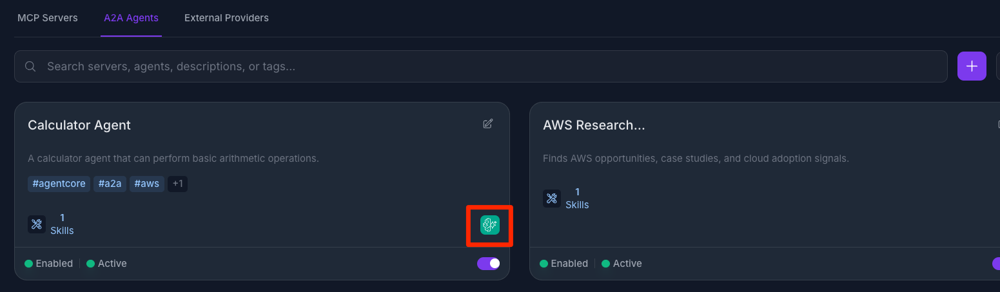

# AgentCore Federation
AgentCore Federation connects an external Amazon Bedrock AgentCore gateway to Jarvis Registry so platform admins can import and govern resources from one control plane.

	<a href="https://ascendingdc.com/jarvis-ai/videos/aws-agentcore-federation-with-jarvis-registry-access-governed-agents-from-any-interface/" target="_blank" rel="noopener noreferrer" style="display: inline-block; position: relative;">
		
		
			<svg width="40" height="40" viewBox="0 0 24 24" fill="none" xmlns="http://www.w3.org/2000/svg" aria-hidden="true">
				<path d="M8 5v14l11-7L8 5z" fill="#fff" />
			</svg>
		
	</a>

This page focuses on the operational flow:

1. Admin creates a federation connection in the UI.
2. Registry syncs MCP servers and A2A agents from AgentCore.
3. Admin reviews imported resources and shares them using the same ACL model used across the registry.

---

## Federation Creation Flow

A federation starts with a simple creation form in Jarvis Registry.

Admins provide:

- **Federation Name** — friendly name for the AgentCore source
- **Connection Settings** — aws region and agentcore assume role
- **Resource Tags Filter** — sync only specific tagged resources or sync all.

After save, Jarvis Registry validates the connection and establishes the federation link.

---

## Automatic Import from AgentCore

Once federation is active, Jarvis Registry can automatically pull resources from AgentCore.

Imported resources include:

- **MCP servers** exposed by the federated AgentCore gateway
- **A2A agents** available from the same federated source

The sync process normalizes external metadata into registry-native entries so they appear in the same catalog experience as local resources.

---

## Admin Governance After Sync

Federated resources are not automatically open to all users. Admins still control visibility and access.

After sync, admins can:

- Keep imported resources private for validation
- Share with specific users or groups
- Publish to everyone with VIEW access when ready

The sharing model is exactly the same as other resources in Jarvis Registry:

- MCP resources follow the same controls as [MCP Server Registry share panel](mcp-registry.md#sharing-a-server)
- Agent resources follow the same controls as [A2A Agent Registry share panel](a2a-registry.md#sharing-an-agent)

Security enforcement (authentication, RBAC, ACL) remains consistent for federated and local resources. See [Security Control Design](../design/security-design.md).

## Next Steps

- [Workflow Orchestration](workflow-orchestration.md) — How AgentCore agents participate in multi-agent, MCP, and skill workflows
- [MCP Server Registry](mcp-registry.md) — Sharing and lifecycle for MCP resources
- [A2A Agent Registry](a2a-registry.md) — Sharing and lifecycle for agent resources
- [Registry Endpoint](registry-endpoint.md) — How clients discover and invoke federated resources
- [Federation Guide](../design/federation.md) — Detailed federation architecture and workflow

**Product page & demo**

- Federation demo and product notes on ASCENDING: [AgentCore & AI Foundry federation](https://ascendingdc.com/jarvis-ai/agent-gateway/agentcore-aifoundry-federation/).
