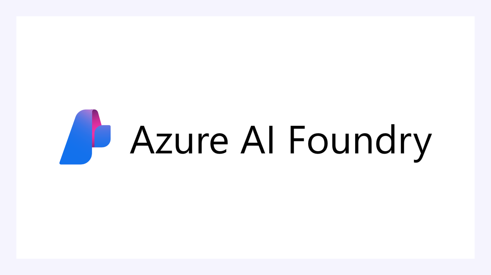

# Azure AI Foundry Federation

	

Azure AI Foundry Federation connects an external Azure AI Foundry workspace to Jarvis Registry so platform admins can import and govern agents from one control plane.

	<iframe width="560" height="315" src="https://www.youtube.com/embed/nXwltEynb98?si=VWqxpsSwyvXZotbw" title="Azure AI Foundry Federation with Jarvis Registry" frameborder="0" allow="accelerometer; autoplay; clipboard-write; encrypted-media; gyroscope; picture-in-picture; web-share" referrerpolicy="strict-origin-when-cross-origin" allowfullscreen></iframe>

This page focuses on the operational flow:

1. Admin creates a federation connection in the UI.
2. Registry syncs A2A agents from the Azure AI Foundry workspace.
3. Admin reviews imported agents and shares them using the same ACL model used across the registry.

---

## Federation Creation Flow

A federation starts with a simple creation form in Jarvis Registry.

Admins provide:

- **Federation Name** — friendly name for the Azure AI Foundry source
- **Connection Settings** — Azure subscription ID, resource group, AI Foundry workspace name, and Entra ID tenant ID
- **Resource Tags Filter** — sync only specific tagged agents or sync all

After save, Jarvis Registry validates the connection using the provided Entra ID credentials and establishes the federation link.

---

## Automatic Import from Azure AI Foundry

Once federation is active, Jarvis Registry automatically pulls agents from the connected workspace.

Imported resources include:

- **A2A agents** available from the Azure AI Foundry Agent Service

Azure AI Foundry agents use non-standard AgentCard discovery paths (e.g. `agentCard/v0.3` rather than `/.well-known/agent-card.json`) and require Entra ID RBAC role assignments before invocation. The sync process normalizes these platform-specific differences — storing the custom discovery paths and auth prerequisites — so imported agents appear in the same catalog experience as local resources and can be invoked without platform-specific client code.

---

## Admin Governance After Sync

Federated agents are not automatically open to all users. Admins still control visibility and access.

After sync, admins can:

- Keep imported agents private for validation
- Share with specific users or groups
- Publish to everyone with VIEW access when ready

The sharing model is exactly the same as other resources in Jarvis Registry:

- Agent resources follow the same controls as [A2A Agent Registry share panel](a2a-registry.md#sharing-an-agent)

Security enforcement (authentication, RBAC, ACL) remains consistent for federated and local resources. See [Security Control Design](../design/security-design.md).

---

## Next Steps

- [Workflow Orchestration](workflow-orchestration.md) — How Foundry agents participate in multi-agent, MCP, and skill workflows
- [A2A Agent Registry](a2a-registry.md) — Sharing and lifecycle for agent resources
- [Registry Endpoint](registry-endpoint.md) — How clients discover and invoke federated resources
- [AgentCore Federation](agentcore-federation.md) — Federation from AWS AgentCore Runtime
- [Federation Guide](../design/federation.md) — Detailed federation architecture and workflow
