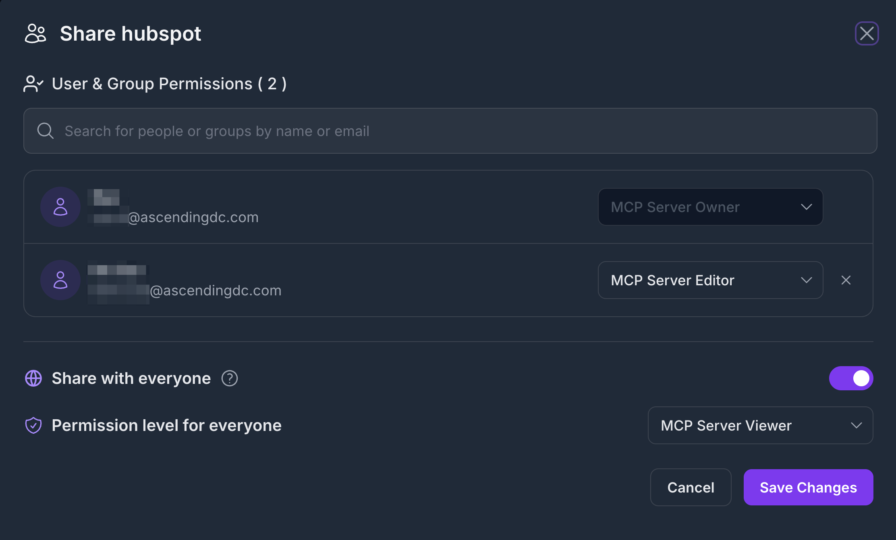
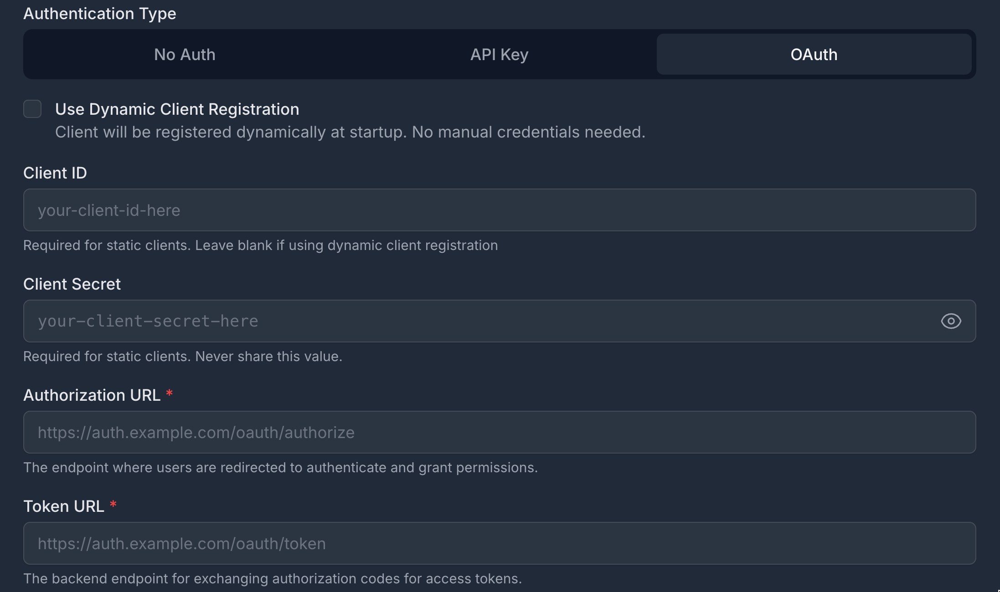

# MCP Server Registry

The MCP Server Registry is the central catalog of all [Model Context Protocol (MCP)](https://exploreagentic.ai/mcp/) servers available in your enterprise. It acts as the hub — registering servers, managing access, and orchestrating secure token exchange so that any authenticated AI copilot can discover and invoke your tools through a single secure gateway.

---

## What is an MCP Server?

An MCP server is any tool, service, or API that speaks the [Model Context Protocol](https://exploreagentic.ai/mcp/). It can be:

- **Enterprise tools** — Jira, Salesforce, GitHub, Slack, internal databases
- **Custom services** — your own Python/TypeScript/Go implementations
- **Cloud APIs** — AWS Lambda, Google Cloud Functions, Azure Functions
- **Local services** — running on your machine or private network

Once registered, any authenticated AI copilot (Cursor, Claude Desktop, GitHub Copilot, VS Code) can discover and invoke it through the registry. How copilots connect and invoke tools is covered in [Registry Endpoint](registry-endpoint.md).

---

## Registering an MCP Server

The registration form collects the essential information the registry needs to catalog, proxy, and secure your server:

- **Name & Description** — human-readable identifier and what the server does (used for semantic search)
- **Transport** — HTTPStreamable (recommended) or SSE
- **MCP Server URL** — where the server is reachable
- **Authentication Type** — No Auth, API Key, or OAuth 2.0
- **Tags** — searchable keywords (e.g., `project-management`, `cloud`, `enterprise`)


!!! tip "Tag generously"
    Add 3–5 descriptive tags per server. The registry's semantic search uses both tags and descriptions, so richer metadata means better discoverability for AI agents.

---

## The MCP Server List

Once registered, your servers appear in the registry catalog. The list view shows all servers you have access to, with key metadata at a glance.


From the list you can:

- **Search & filter** — by name, tag, or transport type
- **Open a server** — view tools, metadata, and access settings
- **Edit or delete** — if you hold EDIT or OWNER permission

---

## Resource Sharing & Access Control

Every MCP server defaults to **private** — visible only to its creator. Sharing is explicit and granular.

### Permission Levels

| Permission | What It Allows |
|---|---|
| **VIEW** | Discover the server; read its tools and metadata |
| **EDIT** | Modify server definition, tools, and metadata |
| **OWNER** | Delete the server; grant or revoke access for others |

The creator is automatically granted OWNER. All other users must be explicitly granted access.

### Sharing a Server

The sharing panel lets you grant access to individuals, groups, or your whole organization.



Sharing options:

- **Individual user** — grant VIEW or EDIT to a specific email
- **Group** — share with an IdP group (synced from Keycloak / Entra ID)
- **Everyone** — publish with VIEW to all authenticated users

For the complete permission enforcement model and how ACL interacts with RBAC, see [Security Control Design](../design/security-design.md)

---

## OAuth Token Management

When an MCP server requires authentication (OAuth 2.0), the registry manages the token lifecycle on behalf of the user — so AI copilots never need to handle credentials directly.

### How It Works

```
AI Copilot
    │
    │  Requests Jira tool via Registry
    ▼
Jarvis Registry
    │  Checks RBAC scope + server ACL
    │  Retrieves or refreshes OAuth token
    ▼
Jira OAuth Server  ──────────►  Returns fresh access token
    │
    ▼
Registry forwards request to Jira MCP server
    │
    ▼
Result returned to AI Copilot
```

1. The registry checks the user's scope and ACL permission for the server.
2. It retrieves the stored OAuth credential from its encrypted store.
3. If the access token is expired or near-expiry, it automatically calls the OAuth token endpoint using the stored refresh token.
4. The fresh token is used for the downstream request — the copilot never sees raw credentials.

### Setting Up OAuth for a Server

When registering (or editing) a server with OAuth, the registry securely captures the client credentials, token endpoint, and requested scopes — all stored encrypted at rest. The registry supports OAuth 2.0 Authorization Server Metadata discovery ([RFC 8414](https://www.rfc-editor.org/rfc/rfc8414)) for automatic endpoint resolution, as well as Dynamic Client Registration ([RFC 7591](https://www.rfc-editor.org/rfc/rfc7591)) for servers that issue client credentials on demand.



### Per-User Credentials

When each user has their own OAuth identity for a backend service (e.g., personal Jira API tokens), the registry stores per-user credentials. When a copilot invokes a tool on behalf of that user, their credential is used instead of the server default.

---

## How AI Copilots Connect

AI copilots discover and invoke MCP servers through the Registry Endpoint — a single secure URL that auto-exposes all servers the user is permitted to access. No per-server configuration is needed in the copilot.

See [Registry Endpoint](registry-endpoint.md) for the full integration guide, including how to wire Cursor, Claude Desktop, GitHub Copilot, and VS Code to the registry.

---

## Next Steps

- [Registry Endpoint](registry-endpoint.md) — Connect any AI copilot to the gateway
- [A2A Agent Registry](a2a-registry.md) — Register autonomous agents alongside MCP servers
- [Security Control Design](../design/security-design.md) — How authentication, RBAC, and ACL compose
