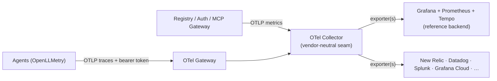
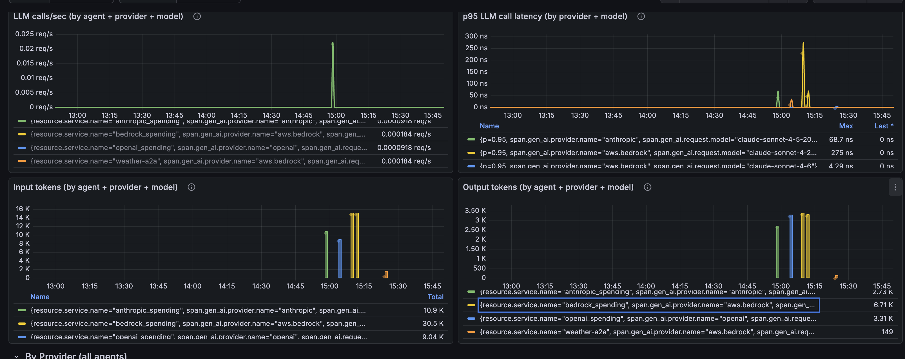

# Observability

Jarvis instruments every layer of the platform with OpenTelemetry and ships that telemetry through a vendor-neutral pipeline. The goal is simple: **connect to whatever observability backend you already use** — Grafana, New Relic, Datadog, Splunk, Grafana Cloud, Honeycomb, and others — without changing a line of application code. 

Two complementary signals tell the whole story: **platform metrics** — what the registry, gateway, and auth server are doing — and **agent traces** — what the LLMs behind the gateway are doing. Both are emitted as OTLP and both flow through a shared OpenTelemetry collector, which is where you choose your backend.

---

## Pipeline at a Glance

Platform components export **metrics**; agents export **traces**. Everything is OTLP. A single collector fans each signal out to one or more backends of your choice.



- **Metrics path** — the registry, MCP gateway, and auth server emit OTLP metrics straight to the collector.
- **Traces path** — agents emit OTLP traces to a hardened gateway collector (bearer-authenticated), which forwards inward to the same collector.
- **Backends** — the collector exports to the reference Grafana stack, any commercial vendor, or several at once.

---

## Connecting an Observability Backend

Because every component emits **OTLP** and nothing is wired to a vendor SDK, the **OTel Collector is the single place a backend is configured**. Switching or adding a backend is a collector config change — no redeploy of the registry or agents, no re-instrumentation.

The collector's config is just receivers → processors → **exporters**. To send to a vendor, add its exporter and reference it in the pipeline:

```yaml
exporters:
  otlphttp/vendor:                 # most backends accept OTLP natively
    endpoint: https://otlp.<vendor>.example.com
    headers:
      api-key: ${env:VENDOR_API_KEY}

service:
  pipelines:
    traces:
      exporters: [otlp/tempo, otlphttp/vendor]          # fan out to both
    metrics:
      exporters: [prometheusremotewrite, otlphttp/vendor]
```

You can export to **multiple backends simultaneously** — useful for migrating vendors, dual-shipping for redundancy, or sending traces to one tool and metrics to another.

| Backend | How the collector ships to it |
|---|---|
| **Grafana / Prometheus / Tempo** | Prometheus + Tempo exporters (self-hosted reference) |
| **Grafana Cloud** | OTLP exporter to the Grafana Cloud OTLP endpoint |
| **New Relic** | OTLP exporter (OTLP-native endpoint + license-key header) |
| **Datadog** | `datadog` exporter, or Datadog's OTLP intake |
| **Splunk** | OTLP to Splunk Observability Cloud, or `splunk_hec` exporter |
| **Others (Honeycomb, Dynatrace, Elastic, …)** | OTLP exporter |

---

## Platform Metrics (Registry, Gateway, Auth)

The registry and auth server are instrumented with OpenTelemetry **metrics** out of the box. Each service calls `setup_metrics(...)` at startup and records measurements through lightweight decorators, so route handlers stay clean while every operation is counted and timed.

- **Instrumentation** — metrics are declared declaratively in `config/metrics/registry.yml` and `config/metrics/auth_server.yml`, then recorded via decorators such as `@track_registry_operation` and `@track_tool_discovery`. Telemetry setup is best-effort: if the collector is unreachable, the service still starts.
- **Export** — services send OTLP/HTTP to the collector (`OTEL_EXPORTER_OTLP_ENDPOINT`, default `http://otel-collector:4318`) under their service names.

What gets captured (counters plus latency histograms with p50/p95/p99):

- **Registry operations** — `registry_operations_total`, `registry_operation_duration_seconds` (list, search, create, …)
- **MCP activity** — `mcp_tool_discovery_total`, `mcp_tool_execution_total`, `mcp_server_requests_total`, `mcp_resource_access_total`, `mcp_prompt_execution_total` with matching `_duration_seconds`
- **Auth** — `auth_requests_total`, token/session/OAuth counters, and `auth_request_duration_seconds`

In the reference backend these power the Grafana dashboards provisioned from `config/grafana/dashboards/` — registry operations, auth-server activity, MCP gateway traffic, and a comprehensive MCP analytics view broken down by source, server, and status.

---

## Agent LLM Traces

Agents that run behind the gateway are instrumented with **OpenLLMetry**, which auto-instruments the underlying LLM SDK (Anthropic, OpenAI, Bedrock) and emits OpenTelemetry GenAI spans.

- **Flow** — agents export OTLP traces to the OTel Gateway, which authenticates each request with a bearer token and forwards to the collector.
- **What gets captured** — one trace per request, with LLM spans carrying `gen_ai.request.model`, `gen_ai.provider.name`, `gen_ai.usage.input_tokens` / `output_tokens`, and call latency.
- **Reference dashboard** — on the Grafana backend, an **Agent LLM Observability** dashboard (built on TraceQL metrics computed from spans) breaks down LLM calls, token usage, and latency by agent, AI provider, and model, with cross-agent rollups and selectors. On another backend, the same span data drives that vendor's equivalent views.



---

## Instrumentation Standard

The agent pipeline standardizes on **OpenLLMetry** as the single instrumentation layer across the fleet. Because it emits the **OpenTelemetry GenAI semantic conventions** — a vendor-neutral attribute set — the captured data is portable across backends, and any agent appears automatically the moment it emits the standard `gen_ai.*` attributes.

Two environment settings keep the fleet consistent:

- **`OTEL_SEMCONV_STABILITY_OPT_IN=gen_ai_latest_experimental`** — selects the latest GenAI conventions so token usage lands under `gen_ai.usage.input_tokens` / `output_tokens`.
- **`OTEL_EXPORTER_OTLP_ENDPOINT`** (or the OpenLLMetry equivalent) — points the agent at the gateway. Telemetry is a no-op when unset, so local and CI runs are unaffected.

---

## Privacy & Content Controls

By default, LLM instrumentation can record the full prompt and completion text as span attributes. The agent pipeline disables this so user payloads never reach any backend:

- **`TRACELOOP_TRACE_CONTENT=false`** — records only metadata (model, token counts, latency) and drops prompt/completion content (`gen_ai.input.messages`, `gen_ai.output.messages`, and prompt/completion attributes).

Content is suppressed **at the source**, so it is never transmitted to the collector — and therefore never to any downstream vendor. Token counts and model metadata are unaffected, so usage and cost views keep working. The platform metrics path carries no content by design (counts and durations only).

---

## Securing the Telemetry Endpoint

Platform metrics travel service-to-collector **inside** the cluster, so that traffic is already private. The externally-reachable surface is the **agent trace gateway**, and how it is exposed determines the network blast radius.

### Default: public ingress with bearer auth

The gateway is fronted by a public, internet-facing load balancer with TLS termination and bearer-token authentication. This works from anywhere, but the OTLP endpoint is reachable from the public internet — protected only by the token.

### More secure: internal load balancer (in-VPC)

When the agents run in the **same VPC** as the gateway (for example, Bedrock AgentCore Runtime configured with VPC connectivity), the endpoint can be kept entirely private by fronting the gateway with an **internal Network Load Balancer (NLB)**:

- The NLB uses an `internal` scheme, so it has **private IPs only** and is unreachable from the internet.
- Agents send OTLP to the NLB's **AWS-assigned DNS name** (`internal-…elb.amazonaws.com`), which resolves privately VPC-wide through the default resolver — **no Route 53 private hosted zone required**.
- Bearer-token authentication is retained as defense-in-depth. TLS can be terminated at the collector, or traffic can stay on plain HTTP since it never leaves the VPC.

NLB is the idiomatic choice for OTLP, which is an L4 (gRPC/HTTP) protocol — it matches the OpenTelemetry gateway deployment pattern of running collectors behind a load balancer.

| Aspect | Public load balancer | Internal NLB |
|---|---|---|
| Internet exposure | Reachable publicly | Private IPs only |
| Stable endpoint | Yes | Yes (AWS NLB DNS) |
| Extra DNS resources | Optional vanity hostname | None |
| Auth | Bearer token + TLS | Bearer token (TLS optional in-VPC) |
| Network scope | Anywhere | Same VPC |

!!! note "Cross-account or cross-VPC agents"
    If the agents are not in the same VPC as the gateway, extend the internal NLB with an **AWS PrivateLink** endpoint service: the consumer VPC reaches the gateway through an interface VPC endpoint and traffic never traverses the public internet. PrivateLink is the same internal NLB plus a private endpoint layer — use it only when crossing an account or VPC boundary; within a single VPC the internal NLB alone is the correct scope.

---

## Next Steps

- [Security Control Design](../design/security-design.md) — How authentication, RBAC, and ACL compose across the platform
- [AgentCore Federation](agentcore-federation.md) — Connecting Amazon Bedrock AgentCore gateways to the registry
- [Registry Endpoint](registry-endpoint.md) — How clients discover and invoke resources through the gateway
