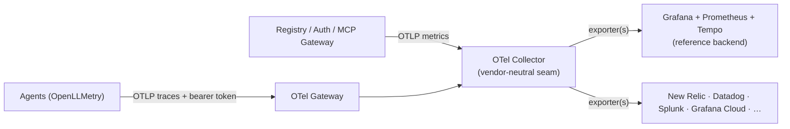

# Observability

Jarvis instruments every layer of the platform with OpenTelemetry and ships that telemetry through a vendor-neutral pipeline. The goal is simple: **connect to whatever observability backend you already use** — Grafana, New Relic, Datadog, Splunk, Grafana Cloud, Honeycomb, and others — without changing a line of application code.

Two complementary signals tell the whole story: **platform metrics** — what the registry, gateway, and auth server are doing — and **agent traces** — what the LLMs behind the gateway are doing. Both are emitted as OTLP and both flow through a shared OpenTelemetry collector, which is where you choose your backend.

---

## Pipeline at a Glance

Platform components export **metrics**; agents export **traces**. Everything is OTLP. A single collector fans each signal out to one or more backends of your choice.



- **Metrics path** — platform services emit performance and usage data that shows what your system is doing: request counts, latency, error rates, and resource utilization.
- **Traces path** — AI agents emit detailed execution traces that show what LLMs are doing: which models are called, how many tokens are used, and how long requests take.
- **Backends** — route your telemetry to any observability platform you already use, or multiple at once, without changing application code.

---

## Connecting an Observability Backend

All telemetry flows through the **OpenTelemetry Collector**, which is where you configure which backend receives your data. The collector receives OTLP from platform services and agents, then exports to one or more backends through **exporters**.

To connect a backend, add its exporter configuration and reference it in the pipeline:

```yaml
exporters:
  otlphttp/vendor:                 # most backends accept OTLP natively
    endpoint: https://otlp.<vendor>.example.com
    headers:
      api-key: ${env:VENDOR_API_KEY}

service:
  pipelines:
    traces:
      exporters: [otlp/tempo, otlphttp/vendor]          # fan out to both
    metrics:
      exporters: [prometheusremotewrite, otlphttp/vendor]
```

You can export to **multiple backends simultaneously** — useful for migrating vendors, dual-shipping for redundancy, or sending traces to one tool and metrics to another.

| Backend | How the collector ships to it |
|---|---|
| **Grafana / Prometheus / Tempo** | Prometheus + Tempo exporters (self-hosted reference) |
| **Grafana Cloud** | OTLP exporter to the Grafana Cloud OTLP endpoint |
| **New Relic** | OTLP exporter (OTLP-native endpoint + license-key header) |
| **Datadog** | `datadog` exporter, or Datadog's OTLP intake |
| **Splunk** | OTLP to Splunk Observability Cloud, or `splunk_hec` exporter |
| **Others (Honeycomb, Dynatrace, Elastic, …)** | OTLP exporter |

---

## Platform Metrics

The platform captures performance and operational metrics from all services:

- **Registry operations** — request counts and latency for list, search, create, update, and delete operations
- **MCP activity** — tool discovery, tool execution, server requests, resource access, and prompt execution with latency percentiles (p50/p95/p99)
- **Auth operations** — authentication requests, token validation, session management, and OAuth flow metrics

These metrics power dashboards that show registry operations, MCP gateway traffic, and authentication activity.

---

## Agent LLM Traces

AI agents emit detailed execution traces that capture:

- **Model and provider** — which LLM model and AI provider was used for each request
- **Token usage** — input and output tokens for cost tracking and usage analysis
- **Request latency** — execution time and performance metrics

The reference Grafana dashboard visualizes LLM call rates, latency percentiles (p95), and token usage broken down by agent, AI provider, and model. The same trace data is available in other observability platforms when configured through the collector.


---

## Instrumentation Standard

The agent pipeline standardizes on **OpenLLMetry** as the single instrumentation layer across the fleet. Because it emits the **OpenTelemetry GenAI semantic conventions** — a vendor-neutral attribute set — the captured data is portable across backends, and any agent appears automatically the moment it emits the standard `gen_ai.*` attributes.

Two environment settings keep the fleet consistent:

- **`OTEL_SEMCONV_STABILITY_OPT_IN=gen_ai_latest_experimental`** — selects the latest GenAI conventions so token usage lands under `gen_ai.usage.input_tokens` / `output_tokens`.
- **`OTEL_EXPORTER_OTLP_ENDPOINT`** (or the OpenLLMetry equivalent) — points the agent at the gateway. Telemetry is a no-op when unset, so local and CI runs are unaffected.

---

## Privacy & Content Controls

By default, LLM instrumentation can record the full prompt and completion text as span attributes. The agent pipeline disables this so user payloads never reach any backend:

- **`TRACELOOP_TRACE_CONTENT=false`** — records only metadata (model, token counts, latency) and drops prompt/completion content (`gen_ai.input.messages`, `gen_ai.output.messages`, and prompt/completion attributes).

Content is suppressed **at the source**, so it is never transmitted to the collector — and therefore never to any downstream vendor. Token counts and model metadata are unaffected, so usage and cost views keep working. The platform metrics path carries no content by design (counts and durations only).

---

## Securing the Telemetry Endpoint

Platform metrics travel service-to-collector inside the cluster and remain private. Agent traces flow through an external gateway, and how you expose that endpoint determines the security posture.

### Default: public endpoint with bearer auth

The gateway is exposed through a public load balancer with TLS termination and bearer-token authentication. This works from anywhere but the OTLP endpoint is reachable from the internet.

### More secure: private VPC endpoint

When agents run in the same virtual private network as the gateway (for example, Amazon Bedrock AgentCore Runtime with VPC connectivity, Azure Container Apps with VNET integration, or GCP Cloud Run with VPC connector), keep the endpoint entirely private:

- Use an **internal load balancer** with private IPs only, unreachable from the internet
- Agents send OTLP to the load balancer's private DNS name, which resolves within the VPC
- Bearer-token authentication provides defense-in-depth
- TLS termination is optional since traffic never leaves the private network

| Aspect | Public endpoint | Private VPC endpoint |
|---|---|---|
| Internet exposure | Reachable publicly | Private IPs only |
| Auth | Bearer token + TLS | Bearer token (TLS optional) |
| Network scope | Anywhere | Same VPC/VNET |

!!! note "Cross-account or cross-VPC scenarios"
    For cross-account or cross-VPC scenarios, use your cloud provider's private connectivity service (AWS PrivateLink, Azure Private Link, GCP Private Service Connect) to extend the internal endpoint without traversing the public internet.

---

## Next Steps

- [Security Control Design](../design/security-design.md) — How authentication, RBAC, and ACL compose across the platform
- [AgentCore Federation](agentcore-federation.md) — Connecting Amazon Bedrock AgentCore gateways to the registry
- [Registry Endpoint](registry-endpoint.md) — How clients discover and invoke resources through the gateway
