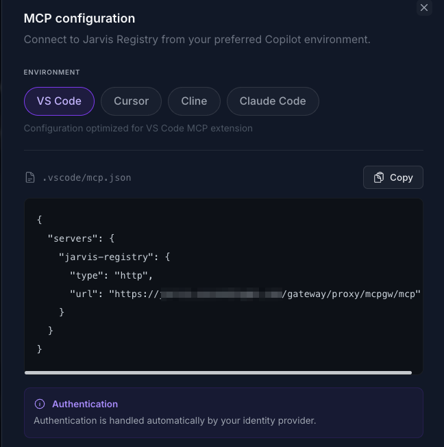
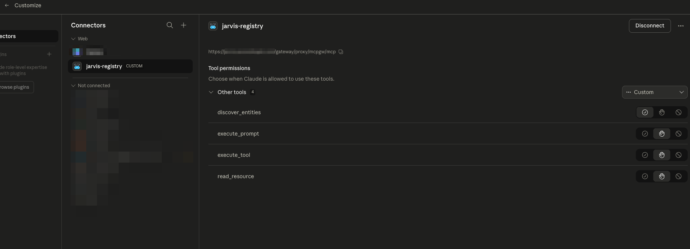
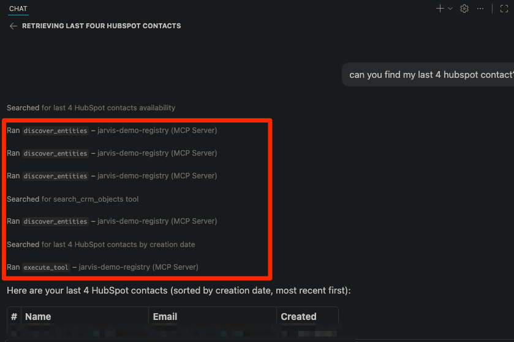

# Registry Endpoint

The Registry Endpoint is the single MCP entry point that AI copilots use to access your enterprise tools and agents.

Instead of configuring every MCP server or A2A agent one by one, you connect your client once to Jarvis Registry. From there, discovery, authorization, token handling, and proxy routing are managed centrally.

---

## One Endpoint for Multiple Copilots

Jarvis Registry supports common MCP clients and coding assistants through the same endpoint model:

- VS Code
- Cursor
- Claude Desktop
- Chatgpt
- Micosoft Copilot
- AWS Kiro
- AWS QuickSuite

All of them connect to the same registry endpoint pattern and then receive only the resources the user is allowed to access.

---

## Automatic IdP Authentication

Client access is automatically integrated with your enterprise IdP through the registry auth layer.

What this means in practice:

1. User signs in through the configured IdP flow.
2. Registry validates tokens and resolves user groups/scopes.
3. All downstream MCP/agent access decisions are based on the authenticated user identity.

This gives users SSO-style access and gives admins centralized identity control without per-tool credential setup in each copilot.

For identity setup details, see [IDP Integration](auth-server.md).

---

## Service Discovery with RBAC + ACL Context

The endpoint supports intelligent discovery so clients can find the right capability with natural language context.

Discovery is permission-aware by default:

- **RBAC filter**: endpoint-level permissions based on user role/scope
- **ACL filter**: resource-level permissions for specific MCP servers and agents
- **Context matching**: discovery ranks tools by relevance to the current task

So when users call discovery (for example through `discover_entities` style workflows), they only see resources they are authorized to use.

This prevents accidental exposure while still enabling fast, context-aware tool selection.

---

## OAuth Elicitation Support

Some downstream tools require OAuth re-authentication during use. The Registry Endpoint supports elicitation-style user prompts so clients can recover without manual backend troubleshooting.

When needed, the flow is:

1. A tool call detects missing/expired downstream OAuth authorization.
2. Registry triggers an elicitation/auth prompt back to the client.
3. User completes authentication.
4. Registry resumes the tool path with refreshed authorization.

This keeps the interaction in-session and reduces failed tool calls caused by token expiry.

---

## Agent Path Routing Through Registry Proxy

Users can also call agents directly by their defined path through the registry proxy.

That enables:

- Consistent routing for both MCP servers and A2A agents
- Policy enforcement at the gateway layer
- Easier debugging and targeted testing of a specific agent endpoint

In other words, even direct path-based interaction still benefits from centralized auth, RBAC, ACL, logging, and observability.

---

## How the Endpoint Fits the Platform

The Registry Endpoint is the runtime layer that connects all feature areas:

- Resources come from [MCP Server Registry](mcp-registry.md), [A2A Agent Registry](a2a-registry.md), and federated sources.
- Security comes from IdP auth, RBAC scopes, and ACL checks.
- Discovery and invocation happen through one consistent interface for every supported copilot.

## Two mins demo videos

<iframe width="560" height="315" src="https://www.youtube.com/embed/EUqWc_mAaXs?si=WUdFaOM06cQliV1o" title="YouTube video player" frameborder="0" allow="accelerometer; autoplay; clipboard-write; encrypted-media; gyroscope; picture-in-picture; web-share" referrerpolicy="strict-origin-when-cross-origin" allowfullscreen></iframe>

---

## Next Steps

- [MCP Server Registry](mcp-registry.md) — Register and share MCP resources
- [A2A Agent Registry](a2a-registry.md) — Register and share autonomous agents
- [AgentCore Federation](agentcore-federation.md) — Import federated MCP servers and agents
- [Security Control Design](../design/security-design.md) — Full auth, RBAC, and ACL model
