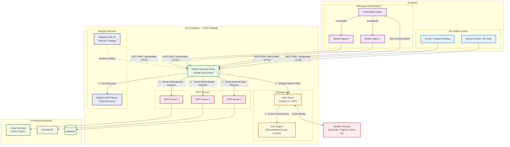

<div align="center">


**Connect any AI copilot or autonomous agent to your enterprise tools — through a single, secure MCP gateway with built-in identity, access control, and full observability.**

</div>

---

## What is Jarvis Registry?

**Jarvis Registry** is an open-source, enterprise-grade **MCP (Model Context Protocol) Gateway and Registry** built by [ASCENDING Inc](https://ascendingdc.com/jarvis-ai/). It solves one of the hardest problems in enterprise AI: giving AI copilots and autonomous agents **secure, governed access** to internal tools and data — without fragmented integrations or security blind spots.

Jarvis Registry acts as a **centralized control plane** that sits between your AI clients (copilots, IDEs, agents) and your enterprise MCP servers. Every request flows through NGINX, is authenticated against your Identity Provider (Keycloak, Amazon Cognito, or Microsoft Entra ID), and checked against fine-grained ACL policies — before a single tool is invoked.

Whether you are plugging GitHub Copilot into internal APIs, orchestrating fleets of autonomous A2A agents, or federating tools across cloud environments, Jarvis Registry gives you the **security, discoverability, and auditability** that enterprise deployments demand.

---

## See It in Action

<div align="center">
<iframe width="800" height="450" src="https://www.youtube.com/embed/EUqWc_mAaXs" title="Jarvis Registry Demo" frameborder="0" allow="accelerometer; autoplay; clipboard-write; encrypted-media; gyroscope; picture-in-picture; web-share" allowfullscreen></iframe>
</div>

---

## What It Does

| Capability | Description |
|---|---|
| **MCP Gateway & Reverse Proxy** | Single authenticated entry point (NGINX) for all AI clients and agents using MCP over SSE or Streamable HTTP |
| **AI Copilot Integration** | Connect Cursor, Claude Desktop, GitHub Copilot, VS Code, and any MCP-compatible copilot to enterprise tools |
| **A2A Agent Orchestration** | Register and manage autonomous agents; orchestrator agents coordinate worker agents through the same secure gateway |
| **Identity & Access Management** | OAuth 2.0/OIDC with Keycloak, Amazon Cognito, and Microsoft Entra ID — no custom auth code needed |
| **Fine-Grained Access Control** | ACL engine enforces scope-based, role-based permissions down to the individual tool level |
| **Dynamic Tool Discovery** | Semantic and tag-based search so agents find the right MCP tool at runtime |
| **Service Registry** | Centralized catalog of all registered MCP servers, tools, and agent capabilities |
| **Audit & Observability** | Full request logging, OpenTelemetry tracing, and Prometheus metrics |

---

## Architecture Overview



---

## Quick Start

Get Jarvis Registry running locally in minutes:

```bash
# Clone the repository
git clone https://github.com/ascending-llc/jarvis-registry.git
cd jarvis-registry

# Copy and configure environment
cp .env.example .env
# Edit .env with your identity provider credentials

# Start all services
docker-compose up -d

# Open the registry UI
open http://localhost:7860
```

See the full [Get Started](quick-start.md) guide for detailed instructions.

---

## Built by ASCENDING Inc

Jarvis Registry is developed and maintained by [ASCENDING Inc](https://ascendingdc.com/jarvis-ai/). For more information about Jarvis AI and our broader AI platform:

- **Website**: [ascendingdc.com/jarvis-ai](https://ascendingdc.com/jarvis-ai/)
- **YouTube**: [ASCENDING Inc Channel](https://www.youtube.com/channel/UCi5_sn38igXkk-4hsR0JGtw)
- **LinkedIn**: [ASCENDING Inc](https://www.linkedin.com/company/ascendingllc/mycompany/)
- **GitHub**: [ascending-llc/jarvis-registry](https://github.com/ascending-llc/jarvis-registry)
