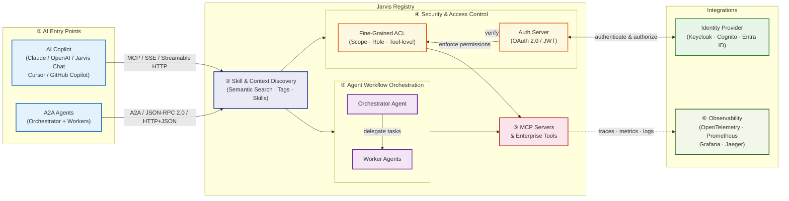

**Connect any AI copilot or autonomous agent to your enterprise tools — through a single, secure gateway with protocol-compliant MCP and A2A support, built-in identity governance, and full observability.**

---

## What is Jarvis Registry?

**Jarvis Registry** is an open-source, enterprise-grade **[MCP (Model Context Protocol)](https://exploreagentic.ai/mcp/) and [A2A Agent](https://exploreagentic.ai/agentic-ai/) Gateway and Workflow Orchestration platform** built by [ASCENDING Inc](https://ascendingdc.com/jarvis-ai/). It solves one of the hardest problems in enterprise AI: giving AI copilots and autonomous agents **secure, governed access** to internal tools and data — without fragmented integrations or security blind spots.

Jarvis Registry acts as a **centralized control plane** that sits between your AI clients (copilots, IDEs, agents) and your enterprise MCP servers. Every request is authenticated against your Identity Provider (Keycloak, Amazon Cognito, or Microsoft Entra ID) and checked against fine-grained ACL policies — before a single tool is invoked.

Whether you are plugging your favorite AI copilot (Claude, OpenAI, or Jarvis Chat) into internal APIs, orchestrating fleets of autonomous A2A agents, or federating tools across cloud environments, Jarvis Registry gives you the **security, discoverability, and auditability** that enterprise deployments demand.

---

## See It in Action

<a class="yt-facade" href="https://www.youtube.com/watch?v=EUqWc_mAaXs" target="_blank" rel="noopener noreferrer" aria-label="Watch Jarvis Registry demo on YouTube (opens in new tab)">
  
  
</a>

---

## What It Does

| Capability | Description |
|---|---|
| [**Gateway & Proxy**](FEATURES.md#1-gateway-proxy) | Single authenticated entry point for all AI clients and agents — supports MCP transports (SSE, Streamable HTTP) and A2A agent transports (JSON-RPC 2.0 over HTTP, HTTP+JSON); routing, rate limiting, and policy enforcement flow directly from the Registry |
| [**Registry**](FEATURES.md#2-registry) | Compliance enforcement layer for MCP servers and A2A agents — validates AgentCard schema, MCP tool declarations, and transport compliance (JSON-RPC 2.0, HTTP+JSON); tracks A2A spec version per agent and stores custom discovery paths and auth prerequisites; the single source of truth the gateway derives every invocation decision from |
| [**AI Copilot Integration**](FEATURES.md#1-gateway-proxy) | Connect Cursor, Claude Desktop, GitHub Copilot, VS Code, and any MCP-compatible copilot to enterprise tools |
| [**Skill & Context-Based Discovery**](FEATURES.md#4-skill-context-based-discovery) | Semantic search over skills, descriptions, and tags so agents and copilots find the right MCP server or A2A agent at runtime |
| [**A2A Agent Workflow**](FEATURES.md#5-a2a-agent-workflow-orchestration) | Register and manage autonomous agents; orchestrator agents coordinate worker agents through the same secure gateway |
| [**Identity & Access Management**](FEATURES.md#3-identity-access-management) | Governance enforcement layer that sits above your IdP (Keycloak, Cognito, Entra ID, Okta) — manages per-agent OAuth 2.0/OIDC auth prerequisites, Client Credentials (M2M) flows, and RBAC mappings, then propagates the enforced policy to the gateway |
| [**Fine-Grained Access Control**](FEATURES.md#3-identity-access-management) | ACL engine enforces scope-based, role-based permissions down to the individual tool level |
| [**Audit & Observability**](FEATURES.md#6-observability-with-opentelemetry) | Full request logging, OpenTelemetry tracing, and Prometheus metrics |

---

## Architecture Overview

## Built by ASCENDING Inc

Jarvis Registry is developed and maintained by [ASCENDING Inc](https://ascendingdc.com/jarvis-ai/). For more information about Jarvis AI and our broader AI platform:

- **Website**: [ascendingdc.com/jarvis-ai](https://ascendingdc.com/jarvis-ai/)
- **Jarvis Registry Product Page**: [ascendingdc.com/jarvis-ai/jarvis-registry](https://ascendingdc.com/jarvis-ai/jarvis-registry)
- **Governed AI Layer**: [ascendingdc.com/jarvis-ai/governed-ai](https://ascendingdc.com/jarvis-ai/governed-ai/)
- **Explore Agentic**: [exploreagentic.ai](https://exploreagentic.ai/) — the field guide to enterprise agentic AI, published by ASCENDING
- **YouTube**: [ASCENDING Inc Channel](https://www.youtube.com/channel/UCi5_sn38igXkk-4hsR0JGtw)
- **LinkedIn**: [ASCENDING Inc](https://www.linkedin.com/company/ascendingllc/mycompany/)
- **GitHub**: [ascending-llc/jarvis-registry](https://github.com/ascending-llc/jarvis-registry)
