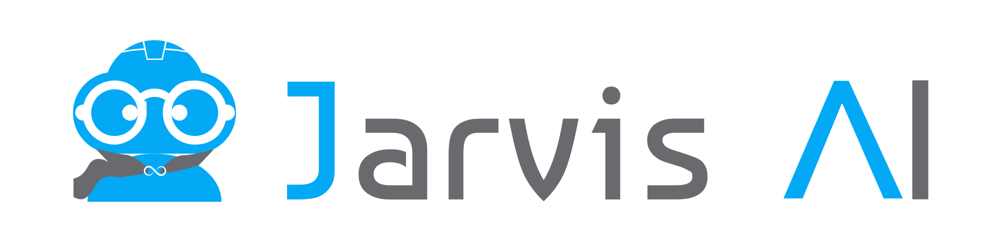
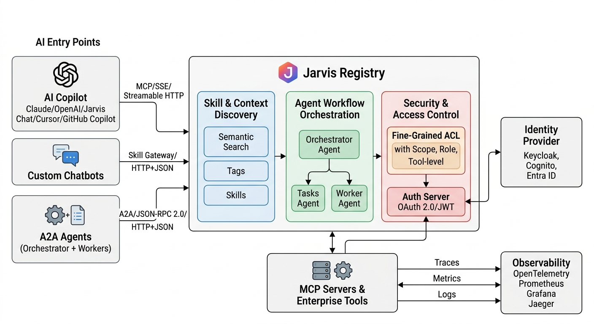

**Connect any AI chatbot, copilot, developer IDE, or autonomous agent to your enterprise tools and curated skills — through the secure [MCP Gateway](https://ascendingdc.com/jarvis-ai/mcp-gateway/), [Agent Gateway](https://ascendingdc.com/jarvis-ai/agent-gateway/), and governed [Skill Gateway](features/skill-gateway.md), with built-in identity governance and full observability.**

---

## What is Jarvis Registry?

**Jarvis Registry** is an open-source, enterprise-grade orchestration platform for **[MCP Gateway](https://ascendingdc.com/jarvis-ai/mcp-gateway/), [Agent Gateway](https://ascendingdc.com/jarvis-ai/agent-gateway/), and [Skill Gateway](features/skill-gateway.md)** capabilities built by [ASCENDING Inc](https://ascendingdc.com/jarvis-ai/). It solves one of the hardest problems in enterprise AI: giving AI chatbots, copilots, developer IDEs, and autonomous agents **secure, governed access** to internal tools, data, and approved skills — without fragmented integrations or security blind spots.

Jarvis Registry acts as a **centralized control plane** for tool calling and orchestration that sits between your AI clients (copilots, custom chatbots, IDEs, agents) and your enterprise MCP servers and skills. Every request is authenticated against your Identity Provider (Keycloak, Amazon Cognito, or Microsoft Entra ID) and checked against fine-grained ACL policies — before a single tool is invoked.

Whether you are building a custom chatbot, connecting Claude Code, Codex, GitHub Copilot, Cursor, or VS Code to internal tools, orchestrating fleets of autonomous A2A agents, or federating tools and skills across cloud environments, Jarvis Registry lets your engineers **focus on the user experience** while the platform handles **secure tool discovery, calling, and orchestration** with built-in governance, discoverability, and auditability.

---

## See It in Action

<a class="yt-facade" href="https://www.youtube.com/watch?v=EUqWc_mAaXs" target="_blank" rel="noopener noreferrer" aria-label="Watch Jarvis Registry demo on YouTube (opens in new tab)">
  
  
</a>

---

## What It Does

| Capability | Description |
|---|---|
| [**Gateway & Proxy**](FEATURES.md#1-gateway-proxy) | Single authenticated entry point for all AI clients and agents — supports [MCP](https://ascendingdc.com/jarvis-ai/mcp-gateway/) transports (SSE, Streamable HTTP), [Agent](https://ascendingdc.com/jarvis-ai/agent-gateway/) transports (JSON-RPC 2.0 over HTTP, HTTP+JSON), and [Skill](https://ascendingdc.com/jarvis-ai/skill-gateway/) Gateway routing, rate limiting, and policy enforcement flow directly from the Registry |
| [**Registry**](FEATURES.md#1-registry) | Compliance enforcement layer for [MCP servers](https://ascendingdc.com/jarvis-ai/mcp-gateway/) and [Agent Registry](https://ascendingdc.com/jarvis-ai/agent-registry/) — validates AgentCard schema, MCP tool declarations, and transport compliance (JSON-RPC 2.0, HTTP+JSON); tracks Agent spec version per agent and stores custom discovery paths and auth prerequisites; the single source of truth the gateway derives every invocation decision from |
| [**Chatbot, Copilot & IDE Integration**](FEATURES.md#1-gateway-proxy) | Connect chatbots, copilots, developer IDEs, and web apps to enterprise tools — including Claude Code, Codex, GitHub Copilot, Cursor, and VS Code. Engineers focus on the user experience; Jarvis Registry handles tool calling, governed skill delivery, and orchestration. |
| [**Skill Management & Distribution**](features/skill-gateway.md) | Manage private, approved skills with categories, tags, versions, supporting files, and ACLs, then distribute accessible skills to Claude Code, Codex, and GitHub Copilot with the [AI Skills CLI](features/ai-skills-cli.md) |
| [**A2A Agent Workflow**](FEATURES.md#5-a2a-agent-workflow-orchestration) | Register and manage autonomous agents; orchestrator agents coordinate worker agents through the same secure gateway |
| [**Identity & Access Management**](FEATURES.md#3-identity-access-management) | Governance enforcement layer that sits above your IdP (Keycloak, Cognito, Entra ID, Okta) — manages per-agent OAuth 2.0/OIDC auth prerequisites, Client Credentials (M2M) flows, and RBAC mappings, then propagates the enforced policy to the gateway |
| [**Fine-Grained Access Control**](FEATURES.md#3-identity-access-management) | ACL engine enforces scope-based, role-based permissions down to the individual tool level |
| [**Audit & Observability**](FEATURES.md#6-observability-with-opentelemetry) | Full request logging, OpenTelemetry tracing, and Prometheus metrics |

---

## Architecture Overview

## Built by ASCENDING Inc

Jarvis Registry is developed and maintained by [ASCENDING Inc](https://ascendingdc.com/jarvis-ai/). For more information about Jarvis AI and our broader AI platform:

- **Website**: [ascendingdc.com/jarvis-ai](https://ascendingdc.com/jarvis-ai/)
- **Jarvis Registry Product Page**: [ascendingdc.com/jarvis-ai/jarvis-registry](https://ascendingdc.com/jarvis-ai/jarvis-registry)
- **Governed AI Layer**: [ascendingdc.com/jarvis-ai/governed-ai](https://ascendingdc.com/jarvis-ai/governed-ai/)
- **Explore Agentic**: [exploreagentic.ai](https://exploreagentic.ai/) — the field guide to enterprise agentic AI, published by ASCENDING
- **YouTube**: [ASCENDING Inc Channel](https://www.youtube.com/channel/UCi5_sn38igXkk-4hsR0JGtw)
- **LinkedIn**: [ASCENDING Inc](https://www.linkedin.com/company/ascendingllc/mycompany/)
- **GitHub**: [ascending-llc/jarvis-registry](https://github.com/ascending-llc/jarvis-registry)
