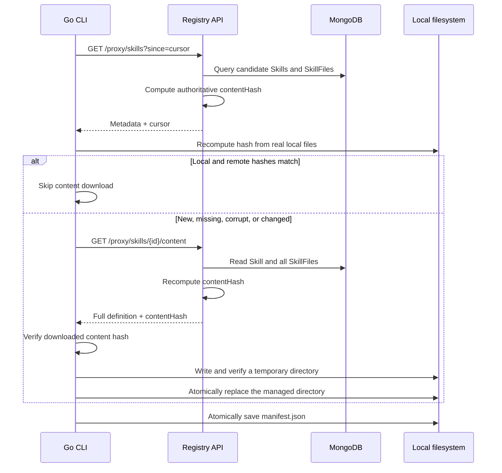

# Skills CLI Sync and Content Hash Design

## 1. Purpose and Current Scope

Jarvis Registry is the remote source of truth for Skill content. A CLI downloads Registry-managed Skills and reconstructs them under the current user's home directory.

The Go program in `scripts/skills-sync` is a **reference implementation and smoke-test client**. Its current purpose is to verify:

- the metadata and content API contracts;
- delta discovery and tombstone behavior;
- deterministic Python/Go content hashing;
- safe local reconstruction and replacement.

It is not the final production CLI architecture. The production CLI can be refactored later as long as it preserves the wire contract, hash contract, and safety invariants described here.

The current Registry exposes a global Skill catalog protected by the `skills-proxy-ops` scope. Per-Skill ACL filtering is intentionally deferred to a later phase.

## 2. Architecture at a Glance

| Component | Responsibility |
|---|---|
| Registry API | Authenticate the CLI, discover changed Skills, return complete textual content, and compute the authoritative content hash |
| MongoDB | Store `Skill` and related `SkillFile` documents |
| Go CLI | Compare remote metadata with real local files, download changed content, independently verify hashes, and update the local filesystem |
| `manifest.json` | Track the last successful cursor and the local paths owned by Registry sync |
| `contentHash` | Prove that the synchronized Skill definition has the same logical content in Python, over HTTP, in Go memory, and after local reconstruction |



## 3. Local Data Boundary

The default local layout is:

```text
~/.jarvis/
├── manifest.json
└── skills/
    └── mongoose-to-beanie/
        ├── SKILL.md
        ├── references/
        └── scripts/
```

`manifest.json` contains sync state, not Skill content:

- the `cursor` returned by the last fully successful sync;
- the local directory `path` owned for each remote Skill ID;
- the Skill name, authoritative `contentHash`, and `updatedAt`.

The CLI never writes MongoDB. It also never deletes a local directory that is not registered in its manifest. The cursor and manifest are updated only after the whole batch completes successfully.

## 4. What the Content Hash Represents

`contentHash` is the identity of the **synchronizable Skill content**. It is not a database version or update timestamp.

It answers this question:

> If two Skills have the same `contentHash`, will the CLI reconstruct the same logical `SKILL.md` definition and the same supporting text-file contents?

### 4.1 Included and excluded fields

| Data | Hashed? | Reason |
|---|---:|---|
| `name` | Yes | Written to `SKILL.md` frontmatter |
| `description` | Yes | Written to `SKILL.md` frontmatter |
| `alwaysApply` | Yes | Written as `always-apply` in YAML |
| `category` | Yes | Written to `SKILL.md` frontmatter |
| `frontmatter` | Yes | YAML frontmatter data other than the promoted fields |
| `body` | Yes | Markdown after the frontmatter; line endings are significant |
| Each file's `relativePath` | Yes | Moving or renaming a supporting file changes the Skill definition |
| Each file's `content` | Yes | Text content is hashed exactly |
| `id`, `author`, `tenantId` | No | Database identity does not change reconstructed content |
| `version`, `updatedAt`, `createdAt` | No | Discovery metadata does not prove content equality |
| `tags`, `path`, `fileCount` | No | Listing and local-directory metadata; a directory rename is not a content change |
| `mimeType`, `bytes` | No | File metadata, not synchronized text content |
| `isBinary` | Validation only | A binary file is rejected before hashing; the flag itself is not in the canonical manifest |

The three related concepts have different jobs:

- `updatedAt` identifies candidates that may have changed;
- `contentHash` proves whether synchronizable content changed;
- `version` cannot replace `contentHash`.

## 5. Shared Cross-Language Hash Input

Python and Go construct the same versioned manifest before applying SHA-256:

```json
{
  "format": "jarvis-skill-content-v1",
  "skill": {
    "name": "mongoose-to-beanie",
    "description": "Migrate Mongoose models to Beanie",
    "alwaysApply": false,
    "category": "migration",
    "frontmatter": {
      "model": "gpt-5"
    },
    "body": "# Mongoose to Beanie\n"
  },
  "files": [
    {
      "relativePath": "references/decisions.md",
      "content": "# Decisions\n"
    }
  ]
}
```

The example is indented for readability. The bytes passed to SHA-256 contain no insignificant spaces or line breaks, and every object key is sorted.

### 5.1 File validation before hashing

Python and Go enforce the same rules:

1. `relativePath` must be a non-empty POSIX relative path.
2. Absolute paths, backslashes, `.`, `..`, and paths that change during normalization are rejected.
3. A Skill cannot contain duplicate `relativePath` values.
4. `isBinary == true` fails because the current API cannot provide authoritative raw binary bytes.
5. `content == null` fails because Registry cannot reconstruct the file completely.
6. Files are sorted by the UTF-8 bytes of `relativePath`, independently of database or response order.

All of these cases fail closed. The system aborts rather than generating a valid-looking hash for incomplete content.

### 5.2 Canonical JSON rules

The v1 rules are:

- encode as UTF-8;
- sort object keys recursively;
- omit insignificant whitespace;
- emit Unicode directly instead of ASCII `\uXXXX` escapes where the language implementation allows it;
- reject non-JSON numeric values such as `NaN` and `Infinity`;
- preserve string content and line endings;
- calculate SHA-256;
- return `sha256:` followed by 64 lowercase hexadecimal characters.

The formula is:

```text
contentHash = "sha256:" + hex_lower(
    SHA256(UTF8(canonical_json(manifest)))
)
```

This is a custom versioned content-hash protocol. It uses SHA-256, but it is not Git's blob or tree hashing algorithm.

## 6. Python Registry Algorithm

Implementation: `registry/src/registry/services/skill_service.py`.

### 6.1 Building the canonical manifest

Python's `_canonical_manifest()`:

1. sorts `SkillFile.relativePath` by UTF-8 bytes;
2. validates paths, duplicates, binary files, and missing content;
3. keeps only `relativePath` and `content` for each supporting file;
4. reads the six synchronizable fields from the Skill;
5. adds the fixed format identifier `jarvis-skill-content-v1`.

The core structure is equivalent to:

```python
manifest = {
    "format": "jarvis-skill-content-v1",
    "skill": {
        "name": skill.name,
        "description": skill.description,
        "alwaysApply": skill.alwaysApply,
        "category": skill.category,
        "frontmatter": skill.frontmatter,
        "body": skill.body,
    },
    "files": [
        {"relativePath": file.relativePath, "content": file.content}
        for file in sorted_files
    ],
}
```

### 6.2 Serialization and SHA-256

`compute_skill_content_hash()` uses:

```python
encoded = json.dumps(
    manifest,
    allow_nan=False,
    ensure_ascii=False,
    separators=(",", ":"),
    sort_keys=True,
).encode("utf-8")

content_hash = "sha256:" + hashlib.sha256(encoded).hexdigest()
```

The parameters are significant:

- `sort_keys=True` recursively sorts object keys;
- `separators=(",", ":")` removes spaces after commas and colons;
- `ensure_ascii=False` encodes Unicode directly as UTF-8;
- `allow_nan=False` rejects non-standard JSON numbers;
- `hexdigest()` returns a 64-character lowercase hexadecimal digest.

### 6.3 When the API computes the hash

`GET /proxy/skills`:

1. queries candidate Skills using `updatedAt >= since`;
2. batch-loads all SkillFiles belonging to those Skills;
3. recomputes the current hash for every candidate;
4. returns the hash in metadata;
5. returns the last item's `updatedAt` as the cursor.

`GET /proxy/skills/{skill_id}/content`:

1. loads the requested Skill;
2. loads all related SkillFiles;
3. recomputes the hash from current content;
4. returns both full content and `contentHash`.

The current read paths compute hashes for the response and mutate only the in-memory Beanie object. They do not call `save()`. Consequently, these APIs do not blindly trust a historical `contentHash` stored in MongoDB.

## 7. Go CLI Algorithm

Implementation:

- `scripts/skills-sync/hash.go` parses local content and implements the hash protocol;
- `scripts/skills-sync/sync.go` applies sync decisions, download validation, and atomic replacement.

### 7.1 Building the same manifest

`computeSkillHash()`:

1. copies and sorts files by `[]byte(relativePath)` without mutating the caller's slice;
2. applies the same path, duplicate, binary, and missing-content checks as Python;
3. builds identical `format`, `skill`, and `files` structures;
4. calls `canonicalJSON()`;
5. calculates the digest with `sha256.Sum256()`;
6. prepends `sha256:`.

The core is:

```go
canonical, err := canonicalJSON(manifest)
if err != nil {
    return "", err
}
digest := sha256.Sum256(canonical)
return "sha256:" + hex.EncodeToString(digest[:]), nil
```

### 7.2 Matching Python's canonical JSON

Go uses the standard `encoding/json` package:

```go
encoder := json.NewEncoder(&output)
encoder.SetEscapeHTML(false)
err := encoder.Encode(value)
```

It then applies three compatibility steps:

1. `encoding/json` sorts `map[string]any` keys, matching Python's `sort_keys=True`.
2. `SetEscapeHTML(false)` prevents `<`, `>`, and `&` from being escaped.
3. The code removes the newline added by `Encoder.Encode()` and restores `U+2028/U+2029` from Go's default escapes to UTF-8 characters.

Go's JSON encoder also rejects `NaN` and infinite values, matching Python's fail-closed behavior.

### 7.3 Reconstructing hash input from the local directory

`hashLocalSkill()` does not trust the old hash saved in `manifest.json`. It reads the real local files:

1. read `<skill>/SKILL.md`;
2. require an opening `---\n` and a closing frontmatter delimiter;
3. map YAML `name`, `description`, `always-apply`, and `category` to fixed Skill fields;
4. treat all remaining YAML keys as `frontmatter`;
5. preserve the Markdown after the delimiter as `body`;
6. recursively read every file except `SKILL.md`;
7. reject symlinks, invalid UTF-8, and binary local files;
8. normalize relative paths to `/`;
9. recompute the hash from the reconstructed definition.

An empty YAML overflow map may decode as `nil`. Go normalizes it to `{}` so that local JSON contains an empty object rather than `null`.

### 7.4 Preserving JSON number semantics through YAML

HTTP responses are decoded with `json.Decoder.UseNumber()` to avoid immediately converting every JSON number to `float64` and losing integer precision.

However, `yaml.v3` would serialize a `json.Number` as text. For example, numeric `4096` could incorrectly become:

```yaml
maxTokens: "4096"
```

Before writing YAML, `normalizeYAMLValue()` recursively handles maps and lists:

- a `json.Number` that parses as an integer becomes an integer;
- another valid JSON number becomes a floating-point value;
- strings, booleans, `null`, maps, and lists retain their meaning.

The resulting YAML remains numeric:

```yaml
maxTokens: 4096
temperature: 0.7
```

After writing, the CLI reads the entire temporary directory back and hashes it again. Any semantic change introduced during JSON-to-YAML-to-filesystem reconstruction is detected before the existing Skill is replaced.

## 8. Python and Go Equivalence

| Step | Python Registry | Go CLI |
|---|---|---|
| Format version | `CONTENT_HASH_FORMAT` | `hashFormat` |
| File sorting | `relativePath.encode("utf-8")` | `bytes.Compare([]byte(relativePath))` |
| Path validation | `PurePosixPath` plus explicit rules | `filepath.Clean` plus explicit rules |
| Canonical JSON | `json.dumps(...)` | `encoding/json.Encoder` plus compatibility processing |
| Unicode | `ensure_ascii=False` | `SetEscapeHTML(false)` plus U+2028/U+2029 restoration |
| Invalid numbers | `allow_nan=False` | `encoding/json` returns an error |
| SHA-256 | `hashlib.sha256()` | `sha256.Sum256()` |
| Hexadecimal | `.hexdigest()` | `hex.EncodeToString()` |
| Prefix | `sha256:` | `sha256:` |

### 8.1 Cross-language test vector

The fixed vector is tested in `scripts/skills-sync/sync_test.go`:

```json
{
  "format": "jarvis-skill-content-v1",
  "skill": {
    "name": "demo",
    "description": "description",
    "alwaysApply": false,
    "category": "testing",
    "frontmatter": {"model": "test-model"},
    "body": "# Demo\n"
  },
  "files": [
    {"relativePath": "references/guide.md", "content": "guide v1"}
  ]
}
```

Python and Go must both produce:

```text
sha256:2bcafdeddf03eb74a9cbbd64f495dbaa4e49e05f13f98fa9db2825247ae67175
```

## 9. Hashes Used During One Sync

A sync can use five related hashes:

| Name | Source | Purpose |
|---|---|---|
| `H_list` | `contentHash` from `/proxy/skills` | Authoritative identity of a remote candidate |
| `H_local` | Recomputed from the existing local directory | Decide whether content must be downloaded |
| `H_content` | `contentHash` from `/proxy/skills/{id}/content` | Confirm the detail response refers to the same remote definition |
| `H_download` | Recomputed by Go from the returned full definition | Detect incomplete, corrupt, or inconsistent response data |
| `H_written` | Recomputed after writing and rereading the temporary directory | Detect changes introduced by JSON, YAML, or filesystem reconstruction |

### 9.1 First sync or remote addition

```text
List returns H_list
    ↓
Remote ID is absent from the local manifest
    ↓
GET /content returns H_content and the full definition
    ↓
Go computes H_download
    ↓
Require H_list == H_content == H_download
    ↓
Write a temporary directory and compute H_written
    ↓
Require H_download == H_written
    ↓
Atomically move it to ~/.jarvis/skills/<path>
    ↓
Add the entry to the in-memory manifest
```

### 9.2 Delta sync with unchanged content

```text
Request ?since=<manifest.cursor>
    ↓
updatedAt >= since may replay the boundary record
    ↓
Go computes H_local from real local files
    ↓
H_local == H_list
    ↓
Do not request /content and count the record as unchanged
```

Therefore, `unchanged=1` does not mean one Skill was updated. It commonly means the inclusive cursor replayed its boundary record and the hash proved that its content was unchanged.

### 9.3 Remote content modification

```text
The changed updatedAt places the Skill in the delta response
    ↓
H_local != H_list
    ↓
Download full content
    ↓
Require H_list == H_content == H_download
    ↓
Write a temporary directory
    ↓
Require H_download == H_written
    ↓
Move the old directory to a temporary backup
    ↓
Atomically rename the verified directory into place
    ↓
Delete the backup and update the in-memory manifest
```

### 9.4 Local manual modification

Normal delta mode only checks candidates returned by Registry. It cannot always discover local drift when nothing changed remotely. `-full` ignores the stored cursor and obtains metadata for every remote Skill:

```text
A local file is modified
    ↓
go run . -full
    ↓
H_local != H_list
    ↓
Download, verify, and restore the Registry version
```

### 9.5 Remote deletion

Deletion depends on a soft-delete tombstone, not a hash:

1. Registry returns `deletedAt != null`.
2. The CLI looks up the remote ID in its manifest.
3. It deletes only the local path stored in the trusted manifest entry.
4. It never deletes directly from the path supplied by the tombstone.
5. A tombstone for an unknown ID is ignored.

This prevents a malicious or invalid remote path from deleting user-owned directories.

## 10. Cursor, Pagination, and Manifest Commit

### 10.1 Inclusive delta cursor

The current list API uses:

```text
updatedAt >= since
```

This intentionally replays the timestamp boundary and avoids dropping records at that exact timestamp. The hash comparison makes the replay safe, although it may produce one or more `unchanged` records.

### 10.2 Pagination is not implemented

The current API has no `limit`, page size, `hasMore`, or compound page cursor. It loads all records matching the delta query and batch-loads their SkillFiles.

Before the catalog grows beyond the internal-test scale, the list API should use a stable compound cursor such as `(updatedAt, id)`. A timestamp alone cannot safely paginate records that share the same `updatedAt`.

### 10.3 Manifest commit boundary

The CLI processes every addition, update, deletion, and hash validation in the response before atomically saving `manifest.json` with the new cursor.

If any Skill fails:

- the command returns an error;
- the cursor is not advanced;
- a partially updated manifest is not saved;
- a failed replacement restores the previous directory from its backup;
- the next command starts from the last successfully persisted cursor.

The atomicity guarantee is **per Skill**, not a filesystem transaction for the whole batch. Previously completed replacements are not rolled back when a later Skill fails.

There is one important recovery gap: if a new Skill directory is installed and a later Skill fails before `manifest.json` is saved, the new directory exists but is not registered as managed. The next retry treats it as an unmanaged path collision and refuses to overwrite it. A production CLI should close this gap by staging the complete batch before committing it, or by safely checkpointing each successful entry.

## 11. Why Multiple Hash Checks Are Required

Comparing only the list hash is insufficient because local files may be missing or corrupt.

Trusting only the hash declared by the detail response is insufficient because the response content itself may be inconsistent.

Hashing only in memory is insufficient because number types, YAML serialization, line endings, or file writes may change the final on-disk representation.

The current design therefore uses three defenses:

1. `H_local == H_list` skips content that is genuinely unchanged.
2. `H_list == H_content == H_download` proves that list metadata, detail metadata, and returned content agree.
3. `H_download == H_written` proves that the reconstructed local directory retains the same logical content.

Any mismatch aborts the sync without advancing the cursor.

## 12. Scenario Matrix

| Scenario | Detection | CLI behavior |
|---|---|---|
| First sync | Manifest does not exist | Fetch all metadata and content, verify, then create directories and manifest |
| Remote addition | ID is absent from manifest | Download, perform three-way validation and disk round-trip validation, then register it |
| Remote modification | Delta returns the item and `H_local != H_list` | Download and atomically replace the managed directory |
| Unchanged content | `H_local == H_list` | Skip the content request and count it as `unchanged` |
| Local modification | `-full` finds `H_local != H_list` | Restore the Registry version |
| Missing or corrupt managed directory | `H_local` cannot be computed | Treat as drift and download again |
| Remote path rename | Same ID with a different path | Move directly when hash matches; otherwise download to the new path and remove the old one |
| Remote tombstone | `deletedAt != null` | Delete only the directory owned in manifest |
| Unknown tombstone | ID is absent from manifest | Ignore it; never delete using the untrusted remote path |
| Download hash mismatch | Three remote/download hashes differ | Abort without installing content or advancing cursor |
| Disk round-trip mismatch | `H_download != H_written` | Abort without replacing the existing directory |
| Binary or uncached file | Python returns HTTP 409 | Abort and preserve current state |
| Invalid or duplicate path | Python or Go validation fails | Abort to prevent traversal or overwrite |
| Unmanaged path collision | Destination exists but ID is absent from manifest | Refuse to overwrite user data |
| Network failure or timeout | Non-200 response or 15-second timeout | Abort without advancing cursor |

## 13. Testing and Verification

Run the Go tests:

```bash
cd scripts/skills-sync
go test ./...
```

The Go suite covers:

- remote addition, modification, and tombstone deletion;
- avoiding `/content` for unchanged content;
- local drift detection and repair;
- the fixed Python/Go hash vector;
- preserving empty frontmatter as `{}` rather than `null`;
- preserving numeric types when nested `json.Number` values pass through YAML;
- manifest cursor and managed-directory updates.

Run the Python hash tests:

```bash
uv run pytest registry/tests/unit/services/test_skill_service.py -q
```

The Python suite covers:

- deterministic output and the `sha256:` format;
- hash changes for each of the six synchronizable Skill fields;
- file-order independence;
- file-content changes;
- fail-closed behavior for binary content, missing content, unsafe paths, and duplicate paths;
- rejection of non-JSON frontmatter;
- inclusive delta-cursor behavior;
- fresh hash computation without saving the Beanie Document.

## 14. Current Limitations and Evolution

- Physically deleting a MongoDB document produces no tombstone and cannot be discovered by delta sync. Registry must retain soft-delete records.
- The API currently has no pagination. A larger catalog requires a stable compound cursor such as `(updatedAt, id)`.
- The timestamp-only cursor uses `$gte`, so the boundary record may be returned again. Hash comparison safely deduplicates it.
- The API does not carry executable file mode. Synchronized scripts are currently written with regular file permissions.
- The system fully supports only available UTF-8 text content. Binary content returns HTTP 409 until authoritative raw bytes are available.
- Arbitrary YAML-number canonicalization still needs a formal cross-language standard, especially for very large integers, exponent notation, and integral floating-point values. The disk round-trip validation protects current common integer and non-integral decimal values.
- `frontmatter` should contain only keys other than the promoted fields. `name`, `description`, `always-apply`, and `category` are reserved.
- Replacement is atomic per Skill, not across the whole sync batch. A new directory installed before a later failure can become an unmanaged-path collision on retry.
- The current global catalog uses scope-based authorization only. Future per-Skill visibility requires ACL-aware filtering in both list and content endpoints.

If an incompatible hash change becomes necessary, introduce a new format identifier such as `jarvis-skill-content-v2`. Never silently change the inputs or serialization rules of v1.
